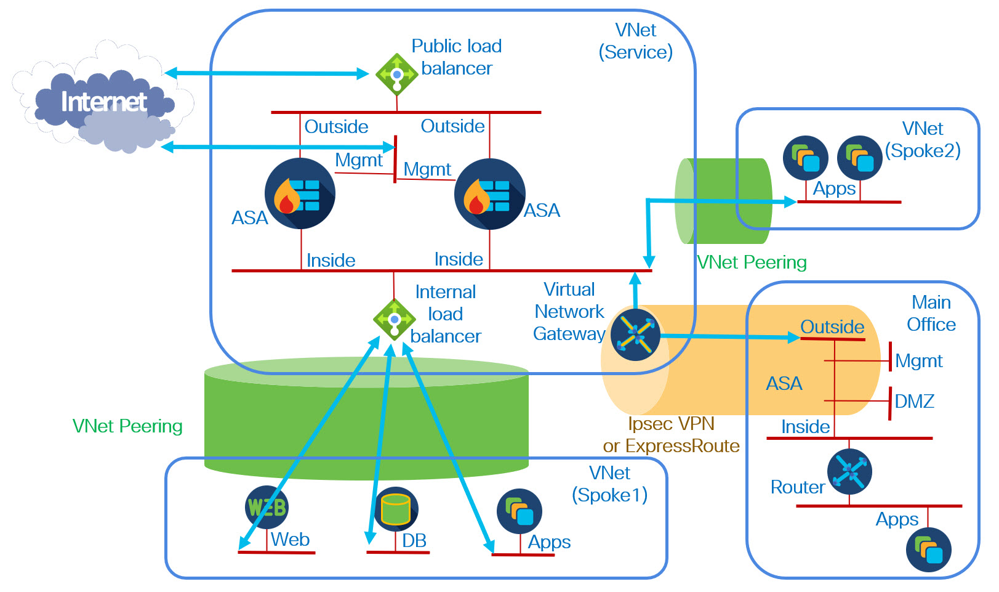
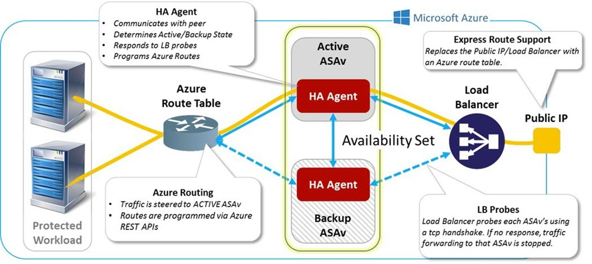

# Deploying a Load Balance Sandwich with ASA Firewall
This folder includes an ARM template called <b>asa.sandwich.json</b> to deploy a load-balanced set of ASA firewall into an existing network. Using this template, you can protect north-south, east-west and outbound traffic.

There is also a sample parameters file called <b>asa.sandwich.parameters.json</b> that can be modified as needed, and then can be used with this template.

## Use cases
The ARM template covers four use cases:
* Multiple ASAs in a single AZ (load balanced sandwich)
* Multiple AZs (load balanced sandwich)
* ASAv HA (active/standby)	
* Standalone ASAv (with load balancers for extensibility)

The trick is that you can set the number of ASAvs and the number of AZs.  The template creates the ASAs and the PLB and ILB. 

## Key features of this template
The ARM template has the following features:
* You can deploy the ASA firewalls into a resource group that already has resources in it.    
* You specify:  
&nbsp; - The number of ASA firewalls in the sandwich 
&nbsp; - The number of availability zones to spread the ASA firewalls across. You can enter <b>0</b> for the number of zones to avoid zone assignment.  
* You must specify the frontend private IP address of the internal load balancer (ILB).  
* All private IP addresses on the ASA firewalls are configured dynamically.  
* The management and outside data interfaces are assigned distinct NSGs.  
* The NSGs and VNet, along with three subnets, must already exist.  Unlike the marketplace, the ASAvs deployed by this template have 3 interfaces, which seems to be the customer preference.  This number can be modified by editing the template.
* The template only creates and associates public IP addresses for the management interface of each ASA firewall.    
* Both IP forwarding and accelerated networking (on supported versions) are enabled, but only on the data interfaces.  

## Availability Zones
One of the parameters in the template specifies the number of Availability Zones.  The firewall instances will be distributed among the Availability Zones using round-robin.
For example, if you select <b>2</b> for the number of Availability Zones and <b>5</b> for the number of firewalls:
* Availability Zone 1 will contain firewall instances 1, 3 and 5.
* Availability Zone 2 will contain firewall instances 2 and 4.

Note that some regions only support two Availability Zones, and some regions do not have Availability Zones.
If you do not want to use availability zones, set the number of Availability Zones to <b>0</b>.

## A note on the VM names and ASA hostnames
The template parameter <b>vmName</b> is the base string used for the names of all resources.  For example, the VM names for the ASAvs are formed by appending <b>-n</b> to this string, where n=1,...,N is a number. To avoid confusion the template always sets the hostname of the ASAv to the VM name. Therefore, <b>vmNAME</b> should be short enough that when <b>-n</b> is appended, it does not exceed 64 characters.  Also, the only special character that should be used is the hyphen (<b>-</b>).

## A note on software versions and instance types
Software versions and supported instance types frequently change. To avoid the need to edit the template, two parameters were created:
* Software Version Other
* VM Size Other

These parameters can be used to override the drop-down lists for Software Display Version and VM Size. 

To override a parameter, select <b>Other</b> from the drop-down list. You can run the Azure CLI command:

<b>az vm image list --all --publisher cisco --offer cisco-asav -o table</b>

to see the current available versions.
Be sure to check Cisco documentation for supported sizes. Be aware that not all regions support the same sizes.

## Resources created by the template
This template creates the following resources. Here the number <i>N</i> represents the number of ASA firewalls
 
* Two load balancers  
&nbsp; - A public load balancer with TCP port 22 probe and two sample load-balancing rules: HTTP and HTTPS   
&nbsp; - An internal load balancer with TCP port 22 probe and one <i>HA Port</i> load-balancing rule to load balance all ports and protocols  
* <i>N+1</i> public IP addresses  
&nbsp; - One for the public load balancer    
&nbsp; - One for the management interface of each ASA firewall  
* <i>3N</i> network interfaces: three for each firewall  
* <i>N</i> storage accounts: one for each firewall  
* <i>N</i> disks: one for each firewall  
* <i>N</i> ASA firewall virtual machines  

## Sample deployment
 
In this deployment the service VNet is the hub of a hub-and-spoke datacenter topology. Only one spoke is shown in the figure. Each spoke uses VNet peering to communicate to the service VNet. An Azure route table must be deployed to handle north-south return traffic, as well as east-west and outbound traffic. This route table must be associated with every subnet in the spoke. The following is a typical route table:  
 
Here the inside internal load balancer has frontend IP address <b>10.100.100.81</b> and the route table is associated with three subnets in the spoke. The spoke VNet CIDR is <b>10.101.0.0/16</b>. Note that you need two routes: the default route for north-south and outbound traffic (and inter-spoke traffic, if other spokes exist), and an additional route for intra-spoke east-west traffic within the spoke VNet.  Without the additional route the intra-spoke east-west traffic will bypass the FTD firewall do to effective (implicit) Azure routing.

The routing table above is for a single spoke.  If there are additional spokes or on-premise traffic that needs inspection, additional routes must be added.

## ASAv HA
Cisco provides an HA agent the Azure ASAv that can answer probes and modify route tables. 
 
To implement this, just set the number of firewalls to <b>2</b> in the template.  The solution typivcally does not use an ILB, but the presence of the ILB does not cause any issues.
By default the HA agent answers to probes on TCP port 44441. You may wish to modify the health probe on the PLB to match this port.
 
Note that unlike the marketplace template for ASAv HA, this template uses availability zones. The marketplace template creates an availability set, which has a lower SLA and can cause administrative overhead.
 
## Prerequisites
Here are the Azure prerequisites for deploying this template.
* A VNet with three subnets. This VNet may be in any resource group.  The subnets correspond to the four interfaces on the ASA firewall:  
&nbsp; - (nic0-n) Management: used for SSH access and FMC access to the ASA firewall   
&nbsp; - (nic1-n) Outside: used as the ingress and egress the Internet   
&nbsp; - (nic2-n) Inside: used for access to and from internal servers  
* An NSG to allow inbound access to the management interface from the FMC on TCP port 8305 and SSH access from the appropriate IP addresses  
* An NSG to allow inbound access to the outside interface for the ports and protocols you wish to expose.  
<!-- end of the list -->
This folder includes ARM templates for two sample NSGs. 
* An NSG called <b>ASAmgmt-nsg.json</b> that allows world inbound SSH and HTTPS access. I practice, you should limit access to selected IPs. This can be associated to the management interface when deploying the template. You should limit the source Ip addresses in this NSG for security reasons.
* An NSG called <b>ASAoutside-nsg.json</b> to allow HTTP and HTTPS inbound access. This can be associated to the outbound interface when deploying the template. You should modify this list of services as is appropriate for the targets of the north-south traffic

## Workflow
1. Create or select a VNet with at least three subnet. 
2. Create or select an NSG to control management access to the ASA firewall.
3. Create or select an NSG to control north-south access to the ASA firewall.
4. (optional) Create a parameters file.
5. Deploy the ARM template.
6. For each ASAv, in the Azure portal, identify the public IP of the ASA management interface (NIC0N)
    [Alternatively, you can login using the private IP from a device with access to the VNet]
7. For each ASAv, perform the initial configuration as described in the next section.

## ASAv initial configuration
The following steps that provide a minimal configuration.  Your particular configuration may be different.
First setup an enable password:
1. Log into the ASAv.  
2. Type <b>enable</b>. You will be asked to set the enable password.  
 
The default deployment puts the default route on the management interface (NIC0N or Management 0/0).  This can be used as the outside interface, but it is not ideal. This template assumes the outside interface is NIC1N or GigabitEthernet0/0. You should therefore put the <i>preferred</i> default route on the outside interface.

Perhaps the best approach to this is to enable <b>management-only</b> on the management interface.  But this conversion requires temporarily connecting from a directly attached network or the console, which can be inconvenient. So instead, this document provides a different solution.

Below are the steps to move the default route for datA to this interface. An alternative is to modify the backend pool of the PLB to use the management interfaces. This can be done by modifying the template, or after deployment by modifying the PLB backend pool.

3. Log into the ASAv.  
4. Type <b>enable</b> and enter the enable password. Enter the following commands:
  <b> config t
   route management 0 0 \<IP address of Azure gateway for management network\> 2
   route management 168.63.129.16 255.255.255.255  \<IP address of Azure gateway for management network\></b>
 
The IP address of the Azure gateway is the first IP address on the management subnet.  You can display this by typing <b>show arp</b> on the ASA. The cost <b>2</b> is essential for the outside interface to take precedence for outbound traffic. But do not put a cost of two on the host route, this must take precedence for DNS lookups.
 
5. Type:
  <b> int m0/0
    ip address dhcp</b>
 
When you type this last command you wiull be logged out of the ASAv.
 
6. Log into the ASAv again 
 7. Type <b>enable</b> and enter the enable password. 
8. The outside interface has no configuration. You can enter the following minimal configuration.
  <b> config t
   int g0/0
   nameif outside
   ip address dhcp
   no shut
   route outside 0 0 \<IP address of Azure gateway for outside network\></b>
   
At this point <b>show route</b> should show the default route on the outside interface. But <b>show run route</b> should show two default routes. Also, you should be able to do a TCP ping out the outside interface when using a hostname: 
<pre><b>
ASAV(config)# ping
TCP Ping [n]: y
Interface: outside
Target IP address: cisco.com
Destination port: [80]
Specify source? [n]:
Repeat count: [5]
Timeout in seconds: [2]
Type escape sequence to abort.
No source specified. Pinging from identity interface.
Sending 5 TCP SYN requests to 72.163.4.185 port 80
from 10.100.200.6, timeout is 2 seconds:
!!!!!
</b>M=</pre>
Note that the ASAv is using the public IP of the PLB as the source for this traffic.
   
9. The inside interface has no configuration. You can enter the following minimal configuration.
  <b> int g0/1
   nameif inside
   ip address dhcp
   no shut
   route inside \<network address for inside network\> \<IP address of Azure gateway for inside network\>
   route inside 168.63.129.16 255.255.255.255  \<IP address of Azure gateway for inside network\> 2</b>
   
The inside network and netmask will depend on your configuration. You may need more than one command. An example would be:
 <b>route inside 10.0.0.0 255.0.0.0 10.100.100.1</b>
 The host route is essential to respond to the ILB probe. The cost of <b>2</b> (or more) is essential or you will break DNS, which is configured to use the management interface.
 
10. Enable SSH on the outside and inside interfaces so that the ASAv answers probes.
 <b> ssh 168.63.129.16 255.255.255.255 outside
  ssh 168.63.129.16 255.255.255.255 inside</b>
11. Type <b>wr me</b> so the configuration will survive a reboot. 
12. Type <b>logout</b> to log out of the ASAv.
   
After completing the initial configuration of each ASAv, wait a couple minutes and confirm that the ASAvs are responding the the PLB and ILB health probes:

12.	In the Azure portal click <b>Home</b>.
  a.	Under Azure services, select <b>Load balancers</b>.
  b.	Select the PLB.
  c.	In the left navigation tab, under <b>Monitoring</b>. Select <b>Metrics</b>. Under the <b>Metrics</b> drop-down, select <b>Health Probe Status</b>.
  d. Click on <b>Apply splitting</b> and select <b>Backend IP Address</b> from the <b>Values</b> drop-down list.
  e. Repeat a through d for the ILB.
