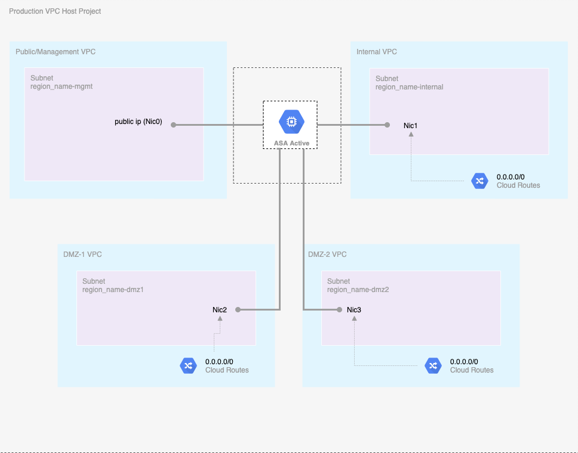
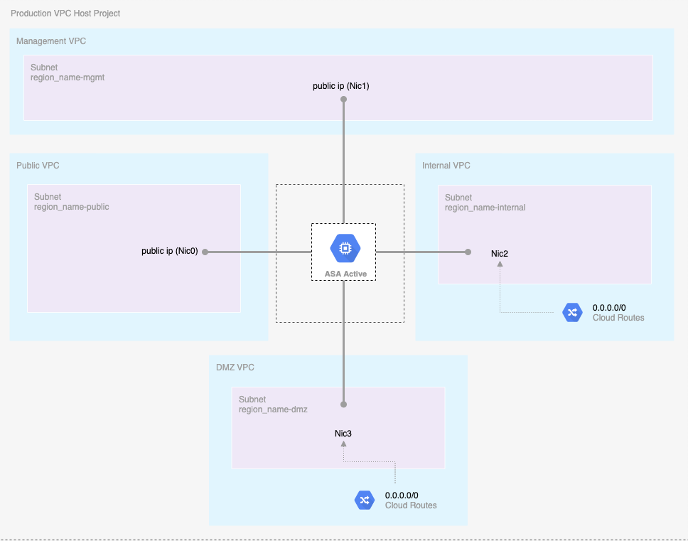
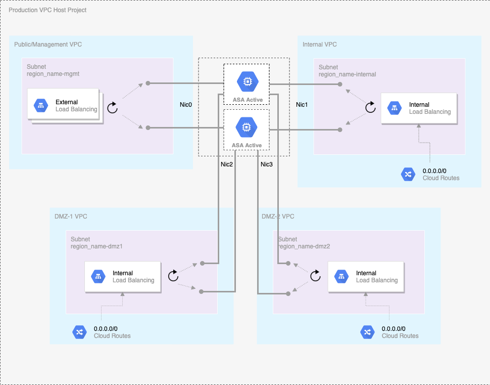

# gdm-cisco-asa

Google Deployment Manager configuration to provision CISCO ASA appliances in GCP

This module simplifies the deployment of for [Cisco ASA in GCP](https://www.cisco.com/c/en/us/td/docs/security/asa/asa916/asav/getting-started/asav-916-gsg/asav_gcp.html).

## ASA version supported

* 9.16
* 9.15

## Compatibility

This module is meant for use with Deployment Manager templates using Python and yaml configurations.

## Use Case Networking Diagram

[Shared management use case](examples/cisco_asa_single_instance_shared.yaml)


[Out of bound use case](examples/cisco_asa_single_instance_oob.yaml)


[HA Shared management use case](examples/cisco_asa_ha.yaml)


## Examples

Examples of how to use these templates can be found in the [examples](examples/) folder.

* [Shared management single instance use case](examples/cisco_asa_single_instance_shared.yaml)
* [Out of bound single instance use case](examples/cisco_asa_single_instance_oob.yaml)
* [HA Shared management multiple instances in the same zone use case](examples/cisco_asa_multi_instances.yaml)
* [HA Shared management use case](examples/cisco_asa_ha.yaml)

### Generate a ssh key pair

```bash
cp shared.tfvars.example shared.tfvars
# modify the shared.tfvars to make sure all the values fit the use case 
# such as admin_ssh_pub_key

# Generate a ssh key pair with 2048 bits key as 2048 bits is supported by ASA
ssh-keygen -t rsa -b 2048 -f admin-ssh-key
```

### Execute Deployment Manager for appliances provisioning

```bash
gcloud deployment-manager deployments create asa-multi  --config examples/cisco_asa_multi_instances.yaml
```

### Cisco CLI validation

```bash
ssh -i admin-ssh-key admin@$NIC0_EXTERNAL_IP_ADDRESS
```

## Source code files naming convention

* templates/*.py :*Template files*
* templates/*.py.schema :*Schema files*
* templates/cisco-asa.py :*Global template file to be used for the use cases*
* examples/*.yaml :*Configuration files*
* scripts/*.txt :*Script files just for reference as the commands are replicated in the Python code*
* helpers/*.py :*Helper files*

## How to specify number of instances?

Please check out [HA Shared management use case](examples/cisco_asa_ha.yaml).

As shown in the snippet below,

* The `num_instances`, `vm_zones` and `networks[*].appliance_ip` need to be matched.
* `networks[*].appliance_ip` is the internal IP address used per network interface (nic).
* Each nic needs a unique IP address.

```hcl
num_instances: 3
vm_zones:
    - us-west1-a
    - us-west1-b
    - us-west1-c
networks:
    - name: vpc-mgmt
    cidr: 10.10.10.0/24
    appliance_ip: ['10.10.10.10', '10.10.10.9']
    external_ip: true
    - name: vpc-inside
    cidr: 10.10.11.0/24
    appliance_ip: ['10.10.11.10', '10.10.11.9']
    external_ip: false
    - name: vpc-dmz1
    cidr: 10.10.12.0/24
    appliance_ip: ['10.10.12.10', '10.10.12.9']
    external_ip: false
    - name: vpc-dmz2
    cidr: 10.10.13.0/24
    appliance_ip: ['10.10.13.10', '10.10.13.9']
    external_ip: false
```

## MultiNic VM

*compute.v1.instance* uses the first network interface as nic0. **mgmt_network** is required for VM's nic0.

## Load Balancer

* External load balancer is for management network
* Internal load balancer is for inside network and outside network
* Each appliance will belongs to a unique unmanaged instance group
* Each unmanaged instance group will be part of backend services for ext and int load balancing

## HA Remarks

Deployment Manager doesn't provide a clear/easy way to add instances to unmanaged instance groups. This solution uses actions to accomplish it.

```python
ADD_INSTANCES_TYPE = 'gcp-types/compute-v1:compute.instanceGroups.addInstances'
```

Actions are a legacy feature and Google recommends to migrate to other approaches. [See more here](https://cloud.google.com/deployment-manager/docs/migrations/actions)

Other available options are based on the use the API directly from startup scripts. However, the base images for this appliance doesn't allow batch execution by default.

Using this startup script from a different VM other than the ASA appliances is a convoluted and hard to maintain solution.

```python
    # Add instances to instance groups instructions
    zone = context.properties['vm_zones'][index]
    ig_name = common.getInstanceGroupName(common.INSTANCE_GROUP_PREFIX, index+1)
    instance_name = common.getInstanceName(common.INSTANCE_PREFIX, index + 1)
    more_steps = '\n'.join([
        '#!/bin/bash',
        'echo "Adding System to instance Group"',
        'TOKEN=$(curl "http://metadata.google.internal/computeMetadata/v1/instance/service-accounts/default/token" -H "Metadata-Flavor: Google"|cut -d \'"\' -f4)',
        'IG_RESPONSE=$(curl -X POST -H "Authorization: Bearer ${TOKEN}" -H "Content-Type: application/json" https://www.googleapis.com/compute/v1/projects/' + context.env['project'] + '/zones/' + zone + '/instanceGroups/' + ig_name + '/addInstances -d \'{ "instances": [{ "instance": "projects/' + context.env['project'] + '/zones/' + zone + '/instances/' + instance_name + '" }] }\')',
        'echo "Instance Group Response:$IG_RESPONSE"'
    ])
```

## Inputs

| Name | Description | Type | Default | Required |
|------|-------------|------|---------|:--------:|
| region | The region of the VPC networks will be created | string | - | yes |
| networks | A list of VPC network related data such as name, cidr range, appliance ip, has external ip or not  | `list`| - | yes |
| mgmt_network | The name of management VPC network | string | - | no |
| inside_network | The name of inside VPC network | string | - | no |
| outside_network | The name of outside VPC network | string | - | no|
| dmz1_network | The name of dmz1 VPC network | string | - | no|
| dmz2_network | The name of dmz2 VPC network | string | - | no|
| ha_enabled | suports HA with network load balancer | bool | false | no |
| num_instances | Number of instances to create | number | 1 | no |
| vm_zones | zones of vm instances | string | - | yes |
| vm_machine_type | The machine type of the instance | string | - | yes |
| vm\_instance\_labels | Labels to apply to the vm instances. | `object` | `{}` | no |
| vm\_instance\_tags | Additional tags to apply to the instances.| `array(string)` | `[]` | no |
| cisco_product_version | product version of cisco appliance | string| - | no |
| day_0_config | The zero day configuration file name, under templates folder|string| - | yes |
| admin_ssh_pub_key| ssh public key for admin user | string| - | yes |
| custom_route_tag | custom route tag for the appliance | string | false | no |
| named_ports | service port name and port for load balancer | `array(object)` | [] | no |
| service_port | service  port for application workload | number | 80 | no |
| use_internal_lb | use internal load balancer | bool | false | no |
| allow_global_access | Internal LB allow global access or not | bool | false | no |
| compute_image | compute image for ASA, debug only | string | - | no |
| startup_script | startup_script for ASA, debug only | string | - | no |

## Outputs

| Name | Description |
|------|-------------|
| vm\_urls| The self link URLs of the vm instances|
| vm_external\_ips | The external IPs of the vm instances|
| external\_lb_ip | The IP of external load balancer |
| internal\_lb_ip | The IP of internal load balancer |
