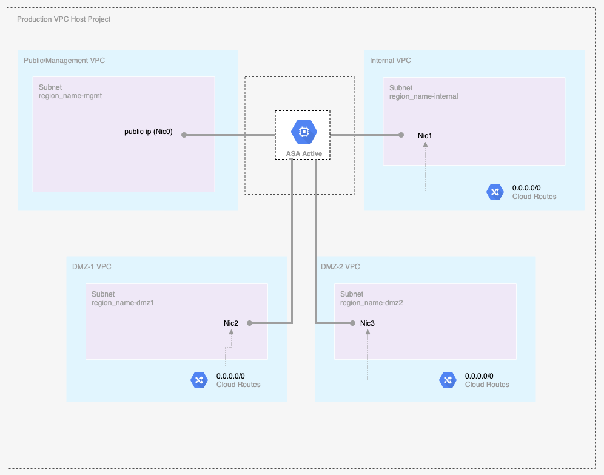
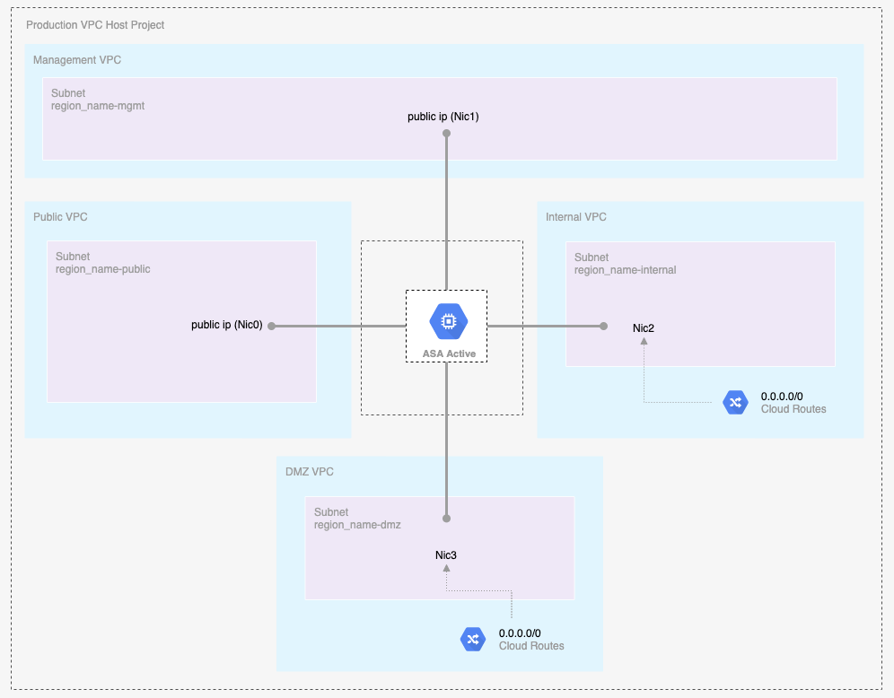
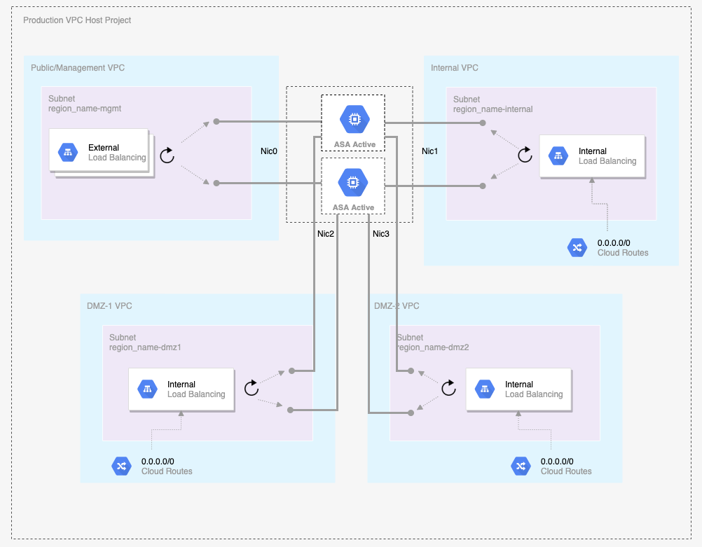
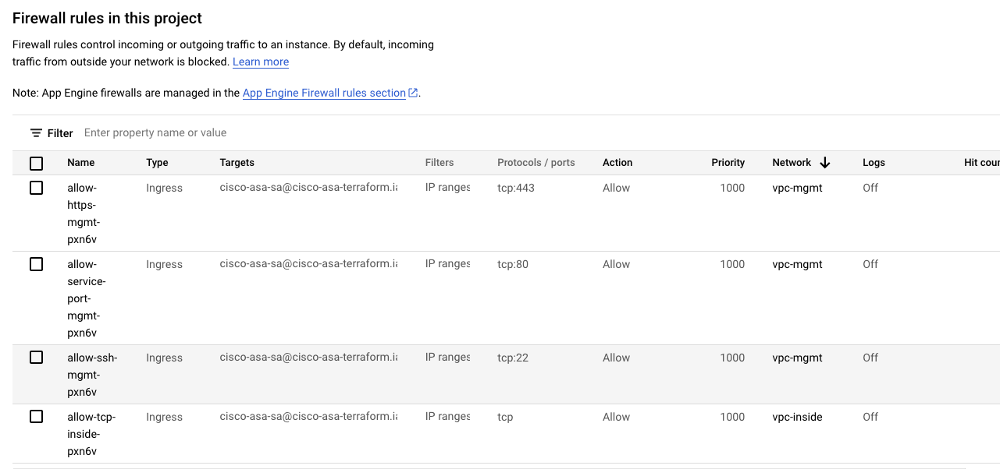
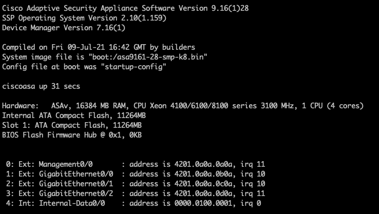

This module simplifies the deployment of for [Cisco ASA in GCP](https://www.cisco.com/c/en/us/td/docs/security/asa/asa916/asav/getting-started/asav-916-gsg/asav_gcp.html).

## ASA version supported
* 9.x

## Compatibility

This module is meant for use with Terraform version >=1.0.3.

## Use Case Networking Diagram

[Shared management use case](examples/single-instance/shared.tfvars.example)

[Out of bound use case](examples/single-instance/oob.tfvars.example)


[HA Shared management use case](examples/ha/shared.tfvars.example)

* Note: In this template load balancer is only created for the inside network in case of Internal Load Balancer 

## Examples

Examples of how to use these modules can be found in the [examples](examples/) folder.
- [Shared management single instance use case](examples/single-instance/shared.tfvars.example)
- [Out of bound single instance use case](examples/single-instance/oob.tfvars.example)
- [HA Shared management multiple instances in the same zone use case](examples/multi-instances/shared.tfvars.example)
- [HA Shared management use case](examples/ha/shared.tfvars.example)

## GCP Resource managed

* New VPC networks, subnets and firewall rules would be created.
* A service account is created and is used as target for firewall rules.
* A single instance or a number of instances would be created depending on use case.
* GCP TCP load balancing related constructs such as forwarding rules, backend services, health check and instance groups would be created.

### (Optional) Set up a GCS backend

```bash
cd examples/single-instance
```

Add backend.tf accordingly,

```hcl
terraform {
  backend "gcs" {
    bucket = "<a-unique-bucket-for-terraform-states>"
    prefix = "asa/single-instance"
  }
}
```

## How to specify number of instances?

Please check out [HA Shared management use case](examples/ha/shared.tfvars.example).

As shown in the snippet below,

* The `num_instances`, `vm_zones` and `networks[*].appliance_ip` need to be matched.
* `networks[*].appliance_ip` is the internal IP address used per network interface (nic).
* Each nic needs a unique IP address.

```hcl

num_instances         = 3
vm_zones              = ["us-west1-a", "us-west1-b", "us-west1-c"]
networks = [
  {
    name         = "vpc-mgmt"

    cidr         = "10.10.10.0/24"
    appliance_ip = ["10.10.10.10", "10.10.10.9", "10.10.10.8"]
    external_ip  = true
  },
  {
    name         = "vpc-inside"
    cidr         = "10.10.11.0/24"
    appliance_ip = ["10.10.11.10", "10.10.11.9", "10.10.11.8"]
    external_ip  = false
  },
  {
    name         = "vpc-dmz1"
    cidr         = "10.10.12.0/24"
    appliance_ip = ["10.10.12.10", "10.10.12.9", "10.10.12.8"]
    external_ip  = false
  },
  {
    name         = "vpc-dmz2"
    cidr         = "10.10.13.0/24"
    appliance_ip = ["10.10.13.10", "10.10.13.9", "10.10.13.8"]
    external_ip  = false
  }
```


## Customize ssh key pair

```bash
# Generate a ssh key pair with 2048 bits key as 2048 bits is used by ASA zero day config as an example here
ssh-keygen -t rsa -b 2048 -f admin-ssh-key
```

Then replace the **admin-ssh-key** public key in the terraform variable file.

## Customize enable password

Please change *enable_password* in *.tfvars.

## Customize firewall rules

.

* Firewall rules would be created as shown.
* Management network allows TCP port 22, 443 and chosen service port such as 80 while other networks allow all TCP ports by default.
* To customize it, please change [firewall.tf](modules/networking/firewall.tf).

## Customize service account

`account_id` is the GCP service account, it can be customized for different deployment if desired.

A service account is a special type of Google Account that represents a Google Cloud service identity or app rather than an individual user. Like users and groups, service accounts can be assigned IAM roles to grant access to specific resources. Service accounts authenticate with a key rather than a password. Google manages and rotates the service account keys for code running on Google Cloud. We recommend that you use service accounts for server-to-server interactions.

Please don't use the default compute engine service account which has the project editor role by default, obviously too permissive. The template would create a service account.

## Customize routes

[networking/main.tf](modules/networking/main.tf) can be changed. Currently leave out for various customization.

## Deploy Using the Terraform CLI

```bash
cd examples/single-instance
cp shared.tfvars.example shared.tfvars
terraform init
terraform plan -var-file=shared.tfvars
terraform apply -var-file=shared.tfvars
terraform destroy -var-file=shared.tfvars
```

## Cisco CLI validation

```bash
IP_ADDRESS=$(terraform output -json vm_external_ips  | jq -r '.[0]')
ssh -i admin-ssh-key admin@$IP_ADDRESS
```



### A note on SSH RSA SHA-1

[OpenSSH release 8.8 and up](https://www.openssh.com/txt/release-8.8) disables RSA signatures using the SHA-1 hash algorithm by default.
If you run into an error: `Unable to negotiate with 34.83.229.123 port 22: no matching host key type found. Their offer: ssh-rsa`
Check if the SSH client with `ssh -V` and see if it is 8.8 up, then you can re-enable RSA/SHA1 to allow connection and/or user
authentication via the HostkeyAlgorithms and PubkeyAcceptedAlgorithms.
```bash
~/.ssh/config
Host x.y.z.x
   HostkeyAlgorithms +ssh-rsa
   PubkeyAcceptedAlgorithms +ssh-rsa
```
Alternatively ```ssh -oHostKeyAlgorithms=+ssh-rsa -oPubkeyAcceptedAlgorithms=+ssh-rsa  -i admin-ssh-key admin@${IP_ADDRESS}``` works too.

## MultiNic VM

* *google_compute_instance* uses the first network interface as nic0.
* *mgmt_network* is required for VM's nic0.

## Load Balancer

* External load balancer is for management network
* Internal load balancer is for inside network and outside network

## Source code files naming convention

* locals.tf: local variables
* variables.tf: input variables
* outputs.tf: output variables
* datasource.tf: define data source such as zones, compute images and template.
* network.tf: define VPC networks, custom routes.
* firewall.tf: define firewall rules.

## Inputs

| Name | Description | Type | Default | Required |
|------|-------------|------|---------|:--------:|
| project_id | The ID of the project where VPC networks will be created | string | - | yes |
| region | The region of the VPC networks will be created | string | - | yes |
| networks | A list of VPC network related data such as name, cidr range, appliance ip, has external ip or not  | `list`| [] | no |
| mgmt_network | The name of management VPC network | string | vpc-mgmt | no |
| inside_network | The name of inside VPC network | string | vpc-inside | no |
| outside_network | The name of outside VPC network | string | vpc-mgmt | no|
| dmz1_network | The name of dmz1 VPC network | string | vpc-dmz1 | no|
| dmz2_network | The name of dmz2 VPC network | string | vpc-dmz2 | no|
| ha_enabled | suports HA with network load balancer | bool | false | no |
| num_instances | Number of instances to create | number | 1 | no |
| vm_zones | zones of vm instances | string | - | yes |
| vm_machine_type | The machine type of the instance | string | - | yes |
| vm\_instance\_labels | Labels to apply to the vm instances. | `map(string)` | `{}` | no |
| vm\_instance\_tags | Additional tags to apply to the instances.| `list(string)` | `[]` | no |
| cisco_product_version | product version of cisco appliance | string| - | no |
| day_0_config | The zero day configuration file name, under templates folder|string| - | yes |
| admin_ssh_pub_key| ssh public key for admin user | string| - | yes |
| enable_password | enable password for admin user | string| - | no |
| custom_route_tag | custom route tag for the appliance | string | false | no |
| named_ports | service port name and port for load balancer | list | [] | no |
| service_port | service  port for application workload | number | 80 | no |
| use_internal_lb | use internal load balancer | bool | false | no |
| allow_global_access | Internal LB allow global access or not | bool | false | no |
| compute_image | compute image for ASA, debug only | string | - | no |
| startup_script | startup_script for ASA, debug only | string | - | no |

## Outputs

| Name | Description |
|------|-------------|
| networks\_map| The internal networks data structure used|
| vm_external\_ips | The external IPs of the vm instances|
| external\_lb_ip | The IP of external load balancer |
| internal\_lb_ip | The IP of internal load balancer |