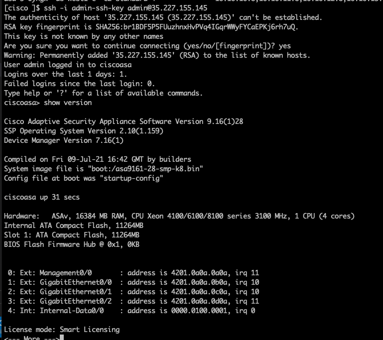

This module simplifies the deployment of [Cisco ASAv in OCI](https://www.cisco.com/c/en/us/td/docs/security/asa/asa917/asav/getting-started/asav-917-gsg/asav_oci.html).

## ASA version supported

* 9.x

## Compatibility

This module is meant for use with Terraform version >=1.0.0.

## Prerequisites

You should complete below pre-requisites before proceeding to next section:
- You have an active Oracle Cloud Infrastructure Account.
  - Tenancy OCID, User OCID, Compartment OCID, Private and Public Keys are setup properly.
- Permission to `manage` the following types of resources in your Oracle Cloud Infrastructure tenancy: `vcns`, `internet-gateways`, `route-tables`, `security-lists`, `subnets`, `network-load-balancers` and `instances`.
- Quota to create the following resources: 4 VCNs, 4 subnets, 2 compute instances, 2 Load balancers.

If you don't have the required permissions and quota, contact your tenancy administrator. See [Policy Reference](https://docs.cloud.oracle.com/en-us/iaas/Content/Identity/Reference/policyreference.htm), [Service Limits](https://docs.cloud.oracle.com/en-us/iaas/Content/General/Concepts/servicelimits.htm), [Compartment Quotas](https://docs.cloud.oracle.com/iaas/Content/General/Concepts/resourcequotas.htm).

## Examples

Examples of how to use these modules can be found in the [examples](examples/) folder.
- [Shared management single instance use case](examples/single-instance/shared.tfvars.example)
- [Out of band single instance use case](examples/single-instance/oob.tfvars.example)
- [multi instances use case](examples/ha/terraform.tfvars.example)

## OCI Resource managed

* New VCN networks, route table, subnets and security lists would be created.
* A single instance or multiple instances of ASAv would be created depending on use case.
* A public and a private Network load balancer are created depending on use case.


## How to specify number of instances?

Please check out [HA Shared management use case](examples/ha/terraform.tfvars.example).

As shown in the snippet below,
- The `num_instances`, `vm_zones` and `networks[*].appliance_ip` need to be matched.
- `networks[*].appliance_ip` is the internal IP address used per network interface (nic).
- Each nic needs a unique IP address.

```hcl

num_instances = 2
# The Availability Domain Number for vm
vm_ads_number = [1, 1]
networks = [
  {
    name        = "mgmt"
    vcn_cidr    = "10.20.0.0/16"
    subnet_cidr = "10.20.1.0/24"
    private_ip  = ["10.20.1.10", "10.20.1.11"]
    external_ip = true
  },
  {
    name        = "inside"
    vcn_cidr    = "10.21.0.0/16"
    subnet_cidr = "10.21.1.0/24"
    private_ip  = ["10.21.1.10", "10.21.1.11"]
    external_ip = false
  },
  {
    name        = "dmz1"
    vcn_cidr    = "10.22.0.0/16"
    subnet_cidr = "10.22.1.0/24"
    private_ip  = ["10.22.1.10", "10.22.1.11"]
    external_ip = false
  },
  {
    name        = "dmz2"
    vcn_cidr    = "10.23.0.0/16"
    subnet_cidr = "10.23.1.0/24"
    private_ip  = ["10.23.1.10", "10.23.1.11"]
    external_ip = false
  }
]

```

## Customize ssh key pair

```bash
# Generate a ssh key pair with 2048 bits key as 2048 bits is supported by ASA
ssh-keygen -t rsa -b 2048 -f admin-ssh-key
```

Then replace the **admin-ssh-key** public key in the terraform variable file.


## Customize enable password

Please change *enable_password* in *.tfvars.

## Customize security list

* To customize it, please change [security list](modules/networking/main.tf).

## Deploy Using the Terraform CLI

```bash
cd examples/single-instance
cp shared.tfvars.example shared.tfvars
terraform init
terraform plan -var-file=shared.tfvars
terraform apply -var-file=shared.tfvars
terraform destroy -var-file=shared.tfvars
```

## Cisco CLI validation

```bash
IP_ADDRESS=$(terraform output -json vm_external_ips  | jq -r '.[0]')
ssh  -i admin-ssh-key admin@$IP_ADDRESS
```


### A note on SSH RSA SHA-1

[OpenSSH release 8.8 and up](https://www.openssh.com/txt/release-8.8) disables RSA signatures using the SHA-1 hash algorithm by default.
If you run into an error: `Unable to negotiate with 34.83.229.123 port 22: no matching host key type found. Their offer: ssh-rsa`
Check if the SSH client with `ssh -V` and see if it is 8.8 up, then you can re-enable RSA/SHA1 to allow connection and/or user
authentication via the HostkeyAlgorithms and PubkeyAcceptedAlgorithms.

```bash
~/.ssh/config
Host x.y.z.x
   HostkeyAlgorithms +ssh-rsa
   PubkeyAcceptedAlgorithms +ssh-rsa
```

Alternatively ```ssh -oHostKeyAlgorithms=+ssh-rsa -oPubkeyAcceptedAlgorithms=+ssh-rsa  -i admin-ssh-key admin@${IP_ADDRESS}``` works too.

## Load Balancer

* External load balancer is for outside network
* Internal load balancer is for inside network

### Testing the internal load balancer

The testing client needs to live within *inside-network* VCN. Then a curl test such as `curl http://<private-lb-ip>:<service-port>` can be used for verification.


## Inputs

| Name | Description | Type | Default | Required |
|------|-------------|------|---------|:--------:|
| tenancy_ocid | The ID of the user tenant | string | - | yes |
| user_ocid | Oracle Cloud Identifier of user deploying the resources | string | - | yes |
| fingerprint | Fingerprint of the user's API Key | string | - | yes |
| private_key_path | Path of the user's API key on the local system | string | - | yes |
| compartment_id | The ID of the compartment where VCN networks will be created | string | - | yes |
| region | The region of the VCN networks will be created | string | - | yes |
| networks | A list of VCN network related data such as name, cidr range, appliance ip, has external ip or not  | `list`| [] | no |
| mgmt_network | The name of management VCN network | string | VCN-mgmt | no |
| inside_network | The name of inside VCN network | string | VCN-inside | no |
| outside_network | The name of outside VCN network | string | VCN-mgmt | no|
| dmz1_network | The name of dmz1 VCN network | string | VCN-dmz1 | no|
| dmz2_network | The name of dmz2 VCN network | string | VCN-dmz2 | no|
| label_prefix | a string that will be prepended to all resources | string | - | yes |
| num_instances | Number of instances to create | number | 1 | no |
| vm_ads_number | az of vm instances | string | - | yes |
| vm_compute_shape | The machine type of the instance | string | - | yes |
| mp_listing_resource_id | product version of ftd in OCI market place | string| - | no |
| day_0_config | The zero day configuration file name, under templates folder|string| - | yes |
| admin_ssh_pub_key| ssh public key for admin user | string| - | yes |
| enable_password | enable password for admin user | string| - | no |
| service_port | service  port for application workload | number | 80 | no |

## Outputs

| Name | Description |
|------|-------------|
| networks\_map| The internal networks data structure used|
| networks\_list| The internal networks data structure used|
| vm_external\_ips | The external IPs of the vm instances|
| vm_private\_ips | The private IPs of the vm instances's nic0|
| external\_lb_ip | The IP of external load balancer |
| internal\_lb_ip | The IP of internal load balancer |
