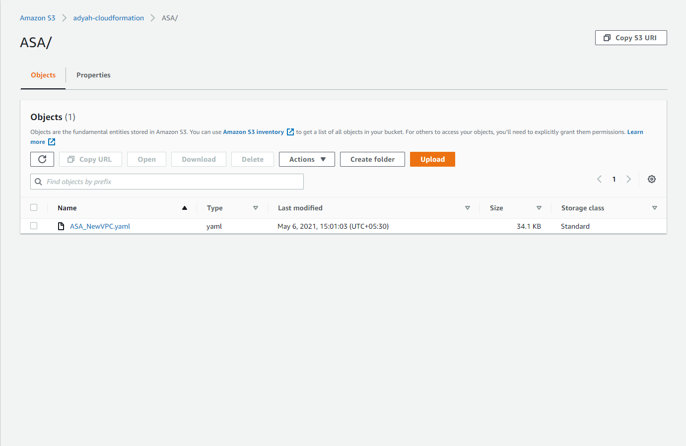
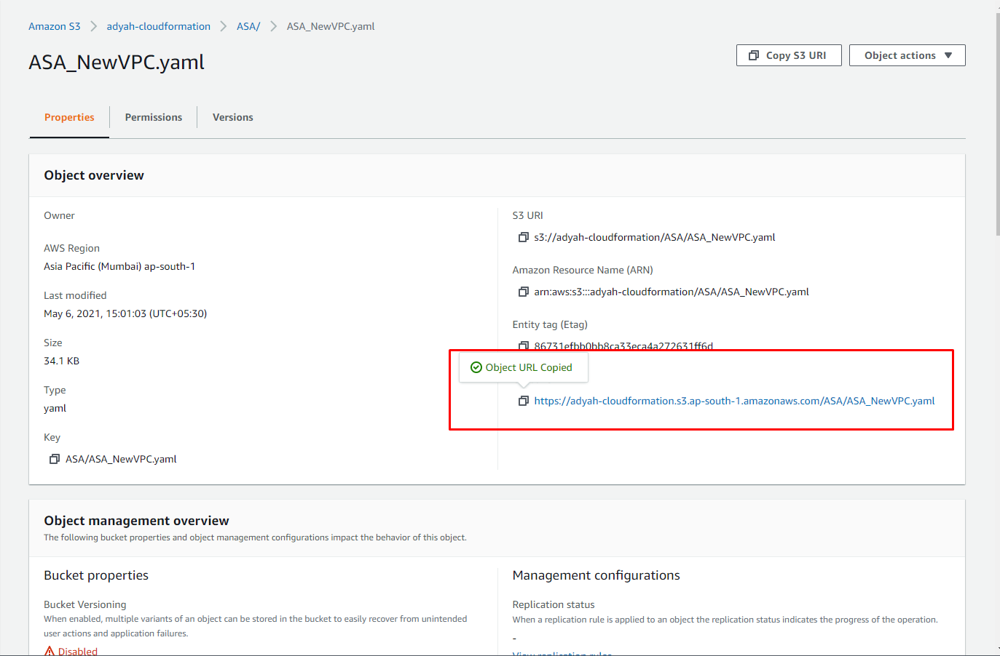

# Multiple ASA instances in a single AZ

## Topology


## Prerequisites

### 1. Deploy Count Macro

In order to deploy these cloud formation templates, `Count macro` shoul be installed in your AWS account. Please find the installation procedure [here](https://github.com/aws-cloudformation/aws-cloudformation-macros/tree/master/Count).  

The number of ASAv instance can range from two to five (both inclusive). One FMC instance is deployed if selected.

### 2. Change the count in the yaml file based on the number of ASAv instances required

Search for `# Change` throughout the yaml and correct the line above for the correct count required. Default is 3.

```yaml
  eipASAMgmt:
    Type: 'AWS::EC2::EIP'
    Properties:
      Domain: !Ref vpc
      Tags:
        - Key: TestKey
          Value: my bucket %d
    Count: 3
    # Change the count based on the number of ASAv instances.
```

```yaml
  eipaASAMgmt:
    Type: 'AWS::EC2::EIPAssociation'
    Properties:
      AllocationId: !GetAtt eipASAMgmt%d.AllocationId
      NetworkInterfaceId: !Ref eniASAMgmt%d
    Count: 3
    # Change the count based on the number of ASAv instances.
```

```yaml
  eniASAMgmt:
    Type: 'AWS::EC2::NetworkInterface'
    Properties:
      SubnetId: !Ref subnetMgmt
      PrivateIpAddress: !If 
        - UseStaticMgmtIp
        - !Ref MgmtIp
        - !Ref 'AWS::NoValue'
      Description: Interface for management traffic of ASA
      GroupSet:
        - !Ref sgManagementInterface
      SourceDestCheck: 'false'
    Count: 3
    # Change the count based on the number of ASAv instances.
```

```yaml
  eniASAInside:
    Type: 'AWS::EC2::NetworkInterface'
    Properties:
      SubnetId: !Ref subnetInside
      PrivateIpAddress: !If 
        - UseStaticInsideIp
        - !Ref InsideIp
        - !Ref 'AWS::NoValue'
      Description: Interface for inside traffic of ASA
      GroupSet:
        - !Ref SecurityGroupAll
      SourceDestCheck: 'false'
    Count: 3
```

```yaml
  eniASAOutside:
    Type: 'AWS::EC2::NetworkInterface'
    Properties:
      SubnetId: !Ref subnetOutside
      PrivateIpAddress: !If 
        - UseStaticOutsideIp
        - !Select [ "%d", !Ref OutsideIp ]
        - !Ref 'AWS::NoValue'
      Description: Interface for outside traffic of ASA
      GroupSet:
        - !Ref SecurityGroupAll
      SourceDestCheck: 'false'
    Count: 3
    # Change the count based on the number of ASAv instances.
```

```yaml
  eniASADmz:
    Condition: SupportsDmz
    Type: 'AWS::EC2::NetworkInterface'
    Properties:
      SubnetId: !Ref subnetDmz
      PrivateIpAddress: !If 
        - UseStaticDmzIp
        - !Ref DmzIp
        - !Ref 'AWS::NoValue'
      Description: Interface for DMZ traffic of ASA
      GroupSet:
        - !Ref SecurityGroupAll
      SourceDestCheck: 'false'
    Count: 3
    # Change the count based on the number of ASAv instances.
```

```yaml
  CiscoASA:
    Condition: SupportsDmz
    Type: 'AWS::EC2::Instance'
    Properties:
      DisableApiTermination: 'false'
      InstanceInitiatedShutdownBehavior: stop
      ImageId: !FindInMap 
        - AWSAMIRegionMap
        - !Ref 'AWS::Region'
        - !FindInMap 
          - KeynameMap
          - !Ref AsaVersion
          - !Ref AsaLicType
      InstanceType: !Ref AsaInstanceType
      KeyName: !Ref KeyName
      Monitoring: 'false'
      Tags:
        - Key: Name
          Value: !Join 
            - ''
            - - !Ref 'AWS::StackName'
              - '-asav'
      BlockDeviceMappings:
        - DeviceName: /dev/xvda
          Ebs:
            DeleteOnTermination: true
      NetworkInterfaces:
        - Description: Management interface
          DeviceIndex: 0
          NetworkInterfaceId: !Ref eniASAMgmt%d
        - Description: Inside network interface
          DeviceIndex: 1
          NetworkInterfaceId: !Ref eniASAInside%d
        - Description: Outside network interface
          DeviceIndex: 2
          NetworkInterfaceId: !Ref eniASAOutside%d
        - Description: DMZ network interface
          DeviceIndex: 3
          NetworkInterfaceId: !Ref eniASADmz%d
      UserData: !Base64 
        'Fn::Join':
          - ''
          - - |
              ! ASA Version 9.4.1.200
            - |
              interface management0/0
            - |
              management-only
            - |
              nameif management
            - |
              security-level 100
            - |
              ip address dhcp setroute
            - |
              no shut
            - |
              !
            - |
              interface GigabitEthernet0/0
            - |
              nameif inside
            - |
              security-level 100
            - |
              ip address dhcp
            - |
              no shut
            - |
              !
            - |
              interface GigabitEthernet0/1
            - |
              nameif outside
            - |
              security-level 0
            - |
              ip address dhcp
            - |
              no shut
            - |
              !
            - |
              interface GigabitEthernet0/2
            - |
              nameif dmz
            - |
              security-level 50
            - |
              ip address dhcp
            - |
              no shut
            - |
              !
            - |
              same-security-traffic permit inter-interface
            - |
              same-security-traffic permit intra-interface
            - |
              !
            - |
              crypto key generate rsa modulus 2048
            - |
              username admin privilege 15
            - |
              username admin attributes
            - |
              service-type admin
            - |
              ! required config end
            - 'hostname '
            - !Ref AsaHostname
            - |+
            - |
              aaa authentication ssh console LOCAL
            - |
              telnet timeout 5
            - |
              ssh stricthostkeycheck
            - |
              ssh 0.0.0.0 0.0.0.0 management
            - |
              ssh timeout 30
            - |
              ssh key-exchange group dh-group14-sha1
            - |
              ssh 0.0.0.0 0.0.0.0 outside
            - |
              console timeout 0
    Count: 3
    # Change the count based on the number of ASAv instances.
```

```yaml
  CiscoASAnoDmz:
    Condition: NoDmz
    Type: 'AWS::EC2::Instance'
    Properties:
      DisableApiTermination: 'false'
      InstanceInitiatedShutdownBehavior: stop
      ImageId: !FindInMap 
        - AWSAMIRegionMap
        - !Ref 'AWS::Region'
        - !FindInMap 
          - KeynameMap
          - !Ref AsaVersion
          - !Ref AsaLicType
      InstanceType: !Ref AsaInstanceType
      KeyName: !Ref KeyName
      Monitoring: 'false'
      Tags:
        - Key: Name
          Value: !Join 
            - ''
            - - !Ref 'AWS::StackName'
              - '-asav'
      BlockDeviceMappings:
        - DeviceName: /dev/xvda
          Ebs:
            DeleteOnTermination: true
      NetworkInterfaces:
        - Description: Management interface
          DeviceIndex: 0
          NetworkInterfaceId: !Ref eniASAMgmt%d
        - Description: Inside network interface
          DeviceIndex: 1
          NetworkInterfaceId: !Ref eniASAInside%d
        - Description: Outside network interface
          DeviceIndex: 2
          NetworkInterfaceId: !Ref eniASAOutside%d
      UserData: !Base64 
        'Fn::Join':
          - ''
          - - |
              ! ASA Version 9.4.1.200
            - |
              interface management0/0
            - |
              management-only
            - |
              nameif management
            - |
              security-level 100
            - |
              ip address dhcp setroute
            - |
              no shut
            - |
              !
            - |
              interface GigabitEthernet0/0
            - |
              nameif inside
            - |
              security-level 100
            - |
              ip address dhcp
            - |
              no shut
            - |
              !
            - |
              interface GigabitEthernet0/1
            - |
              nameif outside
            - |
              security-level 0
            - |
              ip address dhcp
            - |
              no shut
            - |
              !
            - |
              same-security-traffic permit inter-interface
            - |
              same-security-traffic permit intra-interface
            - |
              !
            - |
              crypto key generate rsa modulus 2048
            - |
              username admin privilege 15
            - |
              username admin attributes
            - |
              service-type admin
            - |
              ! required config end
            - 'hostname '
            - !Ref AsaHostname
            - |+
            - |
              aaa authentication ssh console LOCAL
            - |
              telnet timeout 5
            - |
              ssh stricthostkeycheck
            - |
              ssh 0.0.0.0 0.0.0.0 management
            - |
              ssh timeout 30
            - |
              ssh key-exchange group dh-group14-sha1
            - |
              ssh 0.0.0.0 0.0.0.0 outside
            - |
              console timeout 0
    Count: 3
    # Change the count based on the number of ASAv instances.
```

```yaml


This one can be done either here or on the cloudformation UI:

```yaml
NumberOfAsa:
    Description: Number of ASAv instances needed
    Type: Number
    Default: 3
    # Change the default count based on the number of ASAv instances here or in the Cloudformation UI when deploying
```

### 3. Upload the yaml to S3

Once done, upload the yaml to the S3 bucket. You can use the same bucket used for the Count macro or a new one.
Go to [S3 console](https://s3.console.aws.amazon.com/s3/home), select your bucket, make folders if needed and click Upload and upload the yaml file.


Get the Object URL from the page as show below which is needed in the next step:


## Deploying the template

1. Head to the [cloudformation console](https://console.aws.amazon.com/cloudformation/home)

2. Create a new stack with new resources

3. Keep the defaults and paste in the S3 object URL copied in the last step


4. Enter a stack name and proceed to fill in the parameters. The ones needed at minimum are Availability zone (for deploying the ASA instances) and KeyName (used to SSH into the ASA).


5. Hit next, specify any tags if needed and hit next.

6. Review, Acknowledge the below and hit Create Stack to begin the stack initialzation:

>I acknowledge that AWS CloudFormation might require the following capability: CAPABILITY_AUTO_EXPAND

## Post deployment steps

* Wait for the EC2 instances to fully come up


* Validate the presence of a load balancer and the target group with the name as the hostname of the ASA. The target group will be unhealthy until the port specified is opened on the ASAs.


* Validate that the EC2 instances are up and accessible over SSH
  * You can use the command `ssh -i /path/to/keypair.pem admin@<asa_elastic_ip>`

* Perform day one configuration, setting passwords, configuring interfaces, ACLs and twice NAT. All interfaces can be configured for DHCP and they will use the IPs shown on the AWS EC2 console

* Once the ports are open and forwarded to your application, the target groups should show the endpoints as healthy.


* Grab the loadbalancer's DNS name and proceed to access the same. Your application should be available now, protected by Cisco ASAs.
