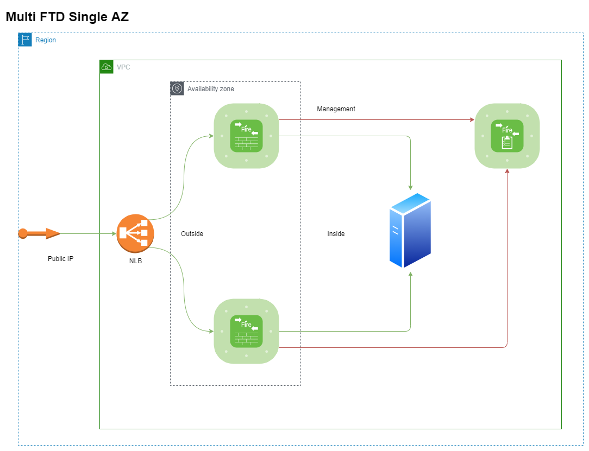
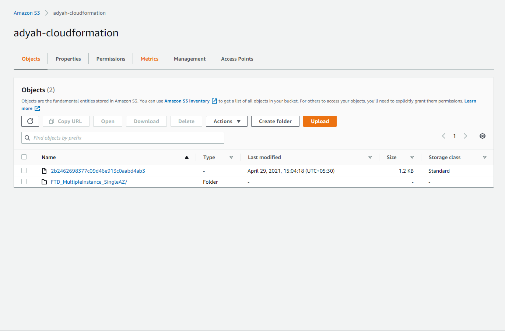
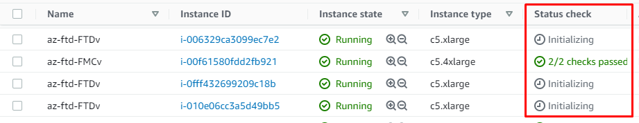
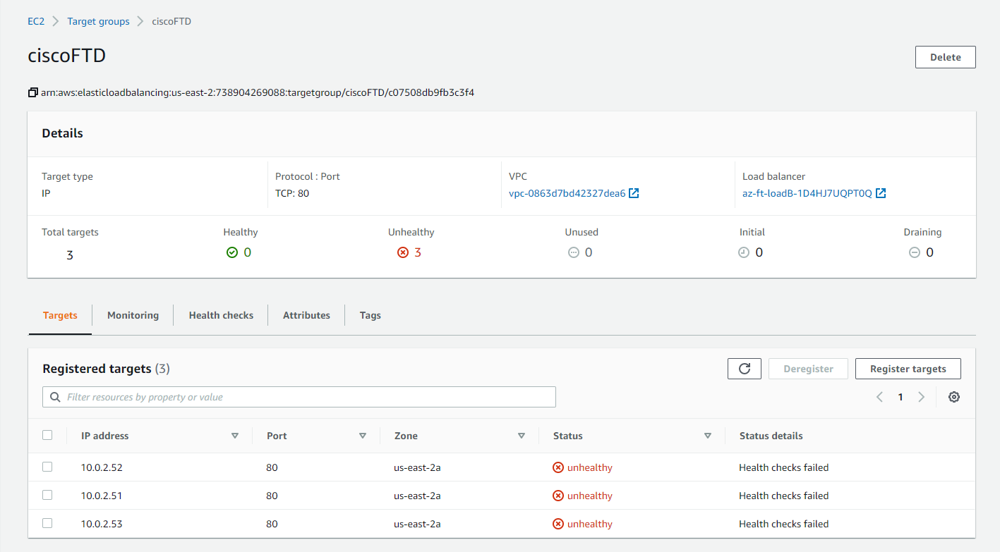

# Multiple FTD instances in a single AZ

## Topology



## Prerequisites

### 1. Deploy Count Macro

In order to deploy these cloud formation templates, `Count macro` shoul be installed in your AWS account. Please find the installation procedure [here](https://github.com/aws-cloudformation/aws-cloudformation-macros/tree/master/Count).  

The number of FTDv instance can range from two to five (both inclusive). One FMC instance is deployed if selected.

### 2. Change the count in the yaml file based on the number of FTDv instances required

Search for `# Change` throughout the yaml and correct the line above for the correct count required. Default is 3.

```yaml
  eniFTDMgmt:
    Type: 'AWS::EC2::NetworkInterface'
    Properties:
      SubnetId: !Ref subnetMgmt
      Tags:
        - Key: Name
          Value: FTD-Mgmt-01
      PrivateIpAddress: !If 
        - UseStaticMgmtIp
        - !Ref MgmtIp
        - !Ref 'AWS::NoValue'
      Description: Interface for management traffic of FTD
      GroupSet:
        - !Ref sgManagementInterface
      SourceDestCheck: 'false'
    Count: 3
    # Change the count based on the number of FTDv instances.
```

```yaml
eipaFTDMgmt:
    Type: 'AWS::EC2::EIPAssociation'
    Properties:
      AllocationId: !GetAtt 
        - eipFTDMgmt%d
        - AllocationId
      NetworkInterfaceId: !Ref eniFTDMgmt%d
    Count: 3
    # Change the count based on the number of FTDv instances.
```

```yaml
  eniFTDMgmt:
    Type: 'AWS::EC2::NetworkInterface'
    Properties:
      SubnetId: !Ref subnetMgmt
      Tags:
        - Key: Name
          Value: FTD-Mgmt-01
      PrivateIpAddress: !If 
        - UseStaticMgmtIp
        - !Ref MgmtIp
        - !Ref 'AWS::NoValue'
      Description: Interface for management traffic of FTD
      GroupSet:
        - !Ref sgManagementInterface
      SourceDestCheck: 'false'
    Count: 3
    # Change the count based on the number of FTDv instances.
```

```yaml
  eniFTDdiag:
    Type: 'AWS::EC2::NetworkInterface'
    Properties:
      SubnetId: !Ref subnetMgmt
      Tags:
        - Key: Name
          Value: FTD-Diag-01
      Description: Interface for diag traffic of FTD
      GroupSet:
        - !Ref sgManagementInterface
      SourceDestCheck: 'false'
    Count: 3
    # Change the count based on the number of FTDv instances.
```

```yaml
  eniFTDInside:
    Type: 'AWS::EC2::NetworkInterface'
    Properties:
      SubnetId: !Ref subnetInside
      Tags:
        - Key: Name
          Value: FTD-Inside-01
      PrivateIpAddress: !If 
        - UseStaticInsideIp
        - !Ref InsideIp
        - !Ref 'AWS::NoValue'
      Description: Inside Interface of FTD
      GroupSet:
        - !Ref SecurityGroupAll
      SourceDestCheck: 'false'
    Count: 3
    # Change the count based on the number of FTDv instances.
```

```yaml
  eniFTDDmz:
    Condition: SupportsDmz
    Type: 'AWS::EC2::NetworkInterface'
    Properties:
      SubnetId: !Ref subnetDmz
      Tags:
        - Key: Name
          Value: FTD-DMZ-01
      PrivateIpAddress: !If 
        - UseStaticDmzIp
        - !Ref DmzIp
        - !Ref 'AWS::NoValue'
      Description: DMZ interface of FTD
      GroupSet:
        - !Ref SecurityGroupAll
      SourceDestCheck: 'false'
    Count: 3
    # Change the count based on the number of FTDv instances.
```

```yaml
  CiscoFTD:
    Condition: SupportsDmz
    Type: 'AWS::EC2::Instance'
    Properties:
      DisableApiTermination: 'false'
      InstanceInitiatedShutdownBehavior: stop
      ImageId: !FindInMap 
        - AWSAMIRegionMap
        - !Ref 'AWS::Region'
        - !FindInMap 
          - KeynameMap
          - !Ref FTDVersion
          - !Ref FTDLicType
      InstanceType: !Ref FTDInstanceType
      KeyName: !Ref KeyName
      Monitoring: 'false'
      Tags:
        - Key: Name
          Value: !Join 
            - ''
            - - !Ref 'AWS::StackName'
              - '-FTDv'
      BlockDeviceMappings:
        - DeviceName: /dev/xvda
          Ebs:
            DeleteOnTermination: true
      NetworkInterfaces:
        - Description: Management interface
          DeviceIndex: 0
          NetworkInterfaceId: !Ref eniFTDMgmt%d
        - Description: Diag interface
          DeviceIndex: 1
          NetworkInterfaceId: !Ref eniFTDdiag%d
        - Description: Inside network interface
          DeviceIndex: 2
          NetworkInterfaceId: !Ref eniFTDInside%d
        - Description: Outside network interface
          DeviceIndex: 3
          NetworkInterfaceId: !Ref eniFTDOutside%d
        - Description: DMZ network interface
          DeviceIndex: 4
          NetworkInterfaceId: !Ref eniFTDDmz%d
      UserData: !Base64 
        'Fn::Join':
          - ''
          - []
    Count: 3
    # Change the count based on the number of FTDv instances.
```

```yaml
  CiscoFTDnoDmz:
    Condition: NoDmz
    Type: 'AWS::EC2::Instance'
    Properties:
      DisableApiTermination: 'false'
      InstanceInitiatedShutdownBehavior: stop
      ImageId: !FindInMap 
        - AWSAMIRegionMap
        - !Ref 'AWS::Region'
        - !FindInMap 
          - KeynameMap
          - !Ref FTDVersion
          - !Ref FTDLicType
      InstanceType: !Ref FTDInstanceType
      KeyName: !Ref KeyName
      Monitoring: 'false'
      Tags:
        - Key: Name
          Value: !Join 
            - ''
            - - !Ref 'AWS::StackName'
              - '-FTDv'
      BlockDeviceMappings:
        - DeviceName: /dev/xvda
          Ebs:
            DeleteOnTermination: true
      NetworkInterfaces:
        - Description: Management interface
          DeviceIndex: 0
          NetworkInterfaceId: !Ref eniFTDMgmt%d
        - Description: Diag interface
          DeviceIndex: 1
          NetworkInterfaceId: !Ref eniFTDdiag%d
        - Description: Inside network interface
          DeviceIndex: 2
          NetworkInterfaceId: !Ref eniFTDInside%d
        - Description: Outside network interface
          DeviceIndex: 3
          NetworkInterfaceId: !Ref eniFTDOutside%d
      UserData: !Base64 
        'Fn::Join':
          - ''
          - []
    Count: 3
    # Change the count based on the number of FTDv instances.
```

```yaml


This one can be done either here or on the cloudformation UI:

```yaml
  NumberOfFtd:
    Description: Number of Ftdv instances needed
    Type: Number
    Default: 3
    # Change the default count based on the number of FTDv instances here or in the Cloudformation UI when deploying
```

### 3. Upload the yaml to S3

Once done, upload the yaml to the S3 bucket. You can use the same bucket used for the Count macro or a new one.
Go to [S3 console](https://s3.console.aws.amazon.com/s3/home), select your bucket, make folders if needed and click Upload and upload the yaml file.

Get the Object URL from the page as show below which is needed in the next step:


## Deploying the template

1. Head to the [cloudformation console](https://console.aws.amazon.com/cloudformation/home)

2. Create a new stack with new resources

3. Keep the defaults and paste in the S3 object URL copied in the last step


4. Enter a stack name and proceed to fill in the parameters. The ones needed at minimum are Availability zone (for deploying the FTD/FMC instances), KeyName (used to SSH into the FTD and FMC) and AddFMC (if you need an FMC).


5. Hit next, specify any tags if needed and hit next.

6. Review, Acknowledge the below and hit Create Stack to begin the stack initialzation:

>I acknowledge that AWS CloudFormation might require the following capability: CAPABILITY_AUTO_EXPAND

## Post deployment steps

* Wait for the EC2 instances to fully come up


* Validate the presence of a load balancer and the target group with the name as the hostname of the FTD. The target group will be unhealthy until the port specified is opened on the FTDs.


* Validate that the EC2 instances are up and accessible over SSH
  * You can use the command `ssh -i /path/to/keypair.pem admin@<ftd_elastic_ip>`

* Perform day one configuration, setting passwords, adding the FTDs to the FMC, configuring devices and interfaces, access policies and twice NAT. All interfaces can be configured for DHCP and they will use the IPs shown on the AWS EC2 console

* Once the ports are open and forwarded to your application, the target groups should show the endpoints as healthy.

* Grab the loadbalancer's DNS name and proceed to access the same. Your application should be available now, protected by Cisco FTDs.
