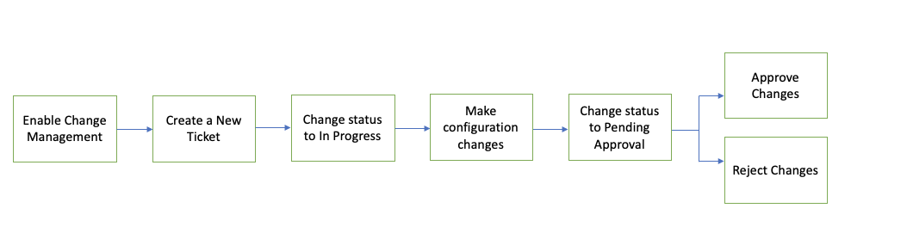

# Cisco Secure Firewall Change Management Workflow Automation Guide

The change management workflow is a new feature in **7.4.1** that is used to enable change management feature on Cisco FMC to ensure changes are monitored and reviwed before applying those changes using Tickets.
This is a document to walkthorugh the different usecases that can be covered using the change management workflow REST API using FMC Ansible Collection.



### Install Cisco FMC Ansible Collection

You can install the Cisco FMC Ansible collection with the Ansible Galaxy CLI:

```
ansible-galaxy collection install cisco.fmcansible
```

### Enabling Change Management on FMC
Run the `enable_changemanagement.yml` file to enable change management on FMC

```
ansible-playbook -i host.yml enable_changemanagement.yml
```

### Create Ticket and Make Changes
Run the `playbook.yml` file. 
- It will create a ticket for the user in the host file
- Update the ticket to In progress state
- Make configuration changes (Create Access Policy)
- Preview the changes associated with the ticket
- Update the ticket to Pending Approval state

### Change Approvals
The approvers can approve changes made by requesters in 3 ways
- Approve the change using the name of the change directly in the script

```
ansible-playbook -i host-approve.yml playbook-approve.yml
```

- Approve the change using the variable 'changename' to input the name of the change to be approved

```
ansible-playbook -i host-approve.yml playbook-approve-varname.yml
```

- Approve the change using the variable 'changeid' to input the UUID of the change to be approved

```
ansible-playbook -i host-approve.yml playbook-approve-varid.yml
```

### Change Rejections
The approvers can Reject changes made by requesters in 3 ways
- Reject the change using the name of the change directly in the script

```
ansible-playbook -i host-approve.yml playbook-reject.yml
```

- Reject the change using the variable 'changename' to input the name of the change to be rejected

```
ansible-playbook -i host-approve.yml playbook-reject-varname.yml
```

- Reject the change using the variable 'changeid' to input the UUID of the change to be rejected

```
ansible-playbook -i host-approve.yml playbook-reject-varid.yml
```

### Deploy Changes
To deploy the changes approved run the following command

```
ansible-playbook -i host.yml deploy.yml
```
