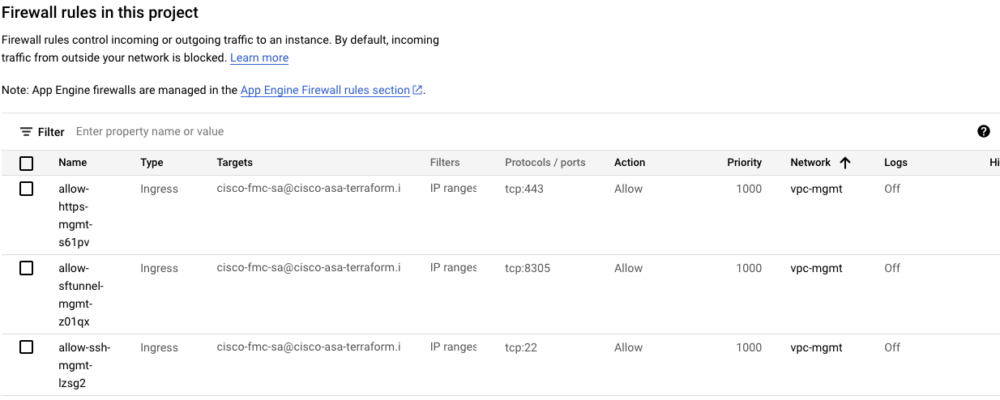
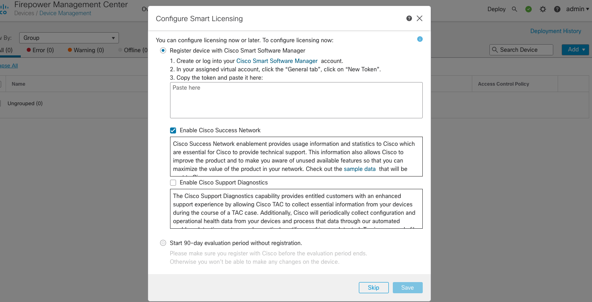

This is a module for [Cisco FMC in GCP](https://www.cisco.com/c/en/us/td/docs/security/firepower/quick_start/fmcv/fpmc-virtual/fpmc-virtual-gcp.html). 


## Compatibility


This module is meant for use with Deployment Manager templates using Python and yaml configurations.

## FMC version supported
* 7.x

## Example usages

Examples of how to use these modules can be found in the [examples](examples/) folder.
- [single instance with new network use case](examples/cisco_fmc_new.yaml). Please note `subnet` is not defined and `network_subnet_cidr_range` needs to be defined
- [single instance with existing network use case](examples/cisco_fmc_existing.yaml). Please note `subnet` is set to an existing subnetwork. 


## GCP Resource managed

* A New VPC network, subnet and firewall rules would be created Or use the existing VPC network and subnet.
* A service account is created and is used as target for firewall rules.
* A single instance or a number of instances would be created depending on use case.

## Customize ssh key pair

```bash
# Generate a ssh key pair with 2048 bits key as 2048 bits is supported by ASA
ssh-keygen -t rsa -b 2048 -f admin-ssh-key
```

Then replace the **admin-ssh-key** public key in the configuration yaml.


## Customize firewall rules

.

* Firewall rules for management interface would be created for management network.
* To customize it, please change [firewall.py](templates/firewall.py).


## Customize service account

`account_id` is the GCP service account, it can be customized for different deployment if desired.

A service account is a special type of Google Account that represents a Google Cloud service identity or app rather than an individual user. Like users and groups, service accounts can be assigned IAM roles to grant access to specific resources. Service accounts authenticate with a key rather than a password. Google manages and rotates the service account keys for code running on Google Cloud. We recommend that you use service accounts for server-to-server interactions.

Please don't use the default compute engine service account which has the project editor role by default, obviously too permissive. The template would create a service account.


## Deploy Using Deployment Manager

```bash
gcloud deployment-manager deployments create fmc \
    --config examples/cisco_fmc_new.yaml

gcloud deployment-manager deployments create fmc \
    --config examples/cisco_fmc_existing.yaml
```


### Screenshots of SSH and HTTPS UI
FMC SSH session
```bash
ssh -i admin-ssh-key admin@$nic0-IP_ADDRESS
```


Please go to FMC GUI via https://${IP_ADDRESS} in a browser.




### A note on SSH RSA SHA-1

[OpenSSH release 8.8 and up](https://www.openssh.com/txt/release-8.8) disables RSA signatures using the SHA-1 hash algorithm by default.
If you run into an error: `Unable to negotiate with 34.83.229.123 port 22: no matching host key type found. Their offer: ssh-rsa`
Check if the SSH client with `ssh -V` and see if it is 8.8 up, then you can re-enable RSA/SHA1 to allow connection and/or user
authentication via the HostkeyAlgorithms and PubkeyAcceptedAlgorithms.
```bash
~/.ssh/config
Host x.y.z.x
   HostkeyAlgorithms +ssh-rsa
   PubkeyAcceptedAlgorithms +ssh-rsa
```

Alternatively ```ssh -oHostKeyAlgorithms=+ssh-rsa -oPubkeyAcceptedAlgorithms=+ssh-rsa  -i admin-ssh-key admin@${IP_ADDRESS}``` works too.
## Source code files naming convention

* templates/*.py :*Template files*
* templates/*.py.schema :*Schema files*
* templates/cisco-asa.py :*Global template file to be used for the use cases*
* examples/*.yaml :*Configuration files*
* scripts/*.txt :*Script files just for reference as the commands are replicated in the Python code*
* helpers/*.py :*Helper files*

## Inputs

| Name | Description | Type | Default | Required |
|------|-------------|------|---------|:--------:|
| region | The region of the VPC networks will be created | string | - | yes |
| network| management network name | string| - | yes |
| subnet | The subnetwork name| string | "" means no existing subnet | yes |
| network_subnet_cidr_range | cidr of the subnetwork | string | - | no |
| appliance_ips | internal IP address of the cisco appliances | list(string) | [] | yes|
| num_instances | Number of instances to create | number | 1 | yes |
| vm_machine_type | The machine type of the instance | string | - | yes |
| vm_zones | zones for vm | string| - | yes|
| hostname |  FMC hostname | string | cisco-fmc | no |
| vm\_instance\_labels | Labels to apply to the vm instances. | `map(string)` | `{}` | no |
| vm\_instance\_tags | Additional tags to apply to the instances.| `list(string)` | `[]` | no |
| boot_disk_size | boot disk size in GB | string | 250 | no |
| boot_disk_type | boot disk type | string | pd-ssd | no |
| cisco_product_version | product version of cisco appliance | string| - | no |
| day_0_config | The zero day configuration file name, under templates folder|string| - | no |
| admin_password | fmc admin password | string | - | no | 
| admin_ssh_pub_key| ssh public key for admin user | string| - | no |

## Outputs

| Name | Description |
|------|-------------|
| vm\_urls| The self link URLs of the vm instances|
| vm\_ips| The external IPs of the vm instances|