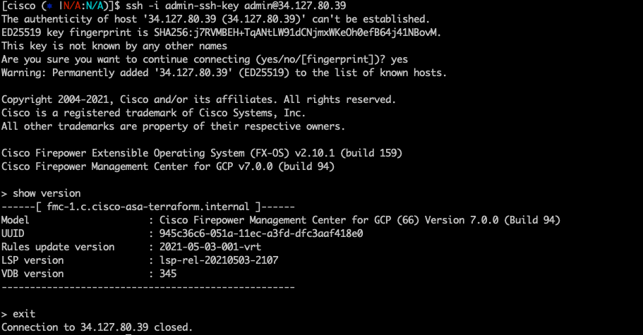

This is a module for [Cisco FMC in GCP](https://www.cisco.com/c/en/us/td/docs/security/firepower/quick_start/fmcv/fpmc-virtual/fpmc-virtual-gcp.html). 


## Compatibility

This module is meant for use with Terraform version >=1.0.0.

## FMC version supported
* 7.x

## Use cases

* [New management network and subnet](examples/single-instance/new-network.tfvars.example)
  When **subnet** input variable is either null or empty, the terraform creates the network, custom route and firewall. 
* [Existing management network and subnet](examples/single-instance/existing-network.tfvars.example)
  When **subnet** input variable is an existing subnet name.

## Example usage
Examples of how to use these modules can be found in the [examples](examples/) folder.
- [single instance with new network use case](examples/single-instance/new-network.tfvars.example)
- [single instance with existing network use case](examples/single-instance/existing-network.tfvars.example)

### (Optional) Set up a GCS backend
```bash
cd examples/single-instance
```
Add backend.tf accordingly,

```hcl
terraform {
  backend "gcs" {
    bucket = "<a-unique-bucket-for-terraform-states>"
    prefix = "fmc/single-instance"
  }
}
```

### Generate a ssh key pair with 2048 bits key as 2048 bits is supported by FMC.


```bash
# Generate a ssh key pair with 2048 bits key as 2048 bits is supported by ASA
ssh-keygen -t rsa -b 2048 -f admin-ssh-key
```

### Execute Terraform for creating the appliances.

```bash
cd examples/single-instance
cp new-network.tfvars.example new-network.tfvars
# modify the  new-network.tfvars to make sure all the values fit the use case 
# such as admin_ssh_pub_key
terraform init 
terraform plan -var-file=new-network.tfvars
terraform apply -var-file=new-network.tfvars
terraform destroy -var-file=new-network.tfvars
```
### Screenshots of SSH and HTTPS UI
FMC SSH session
```bash
IP_ADDRESS=$(terraform output -json vm_external_ips  | jq -r '.[0]')
ssh -i admin-ssh-key admin@$IP_ADDRESS
```


Please go to FMC GUI via https://${IP_ADDRESS} in a browser.


## Source code files naming convention

* locals.tf: local variables
* variables.tf: input variables
* outputs.tf: output variables
* datasource.tf: define data source such as zones, compute images and template.
* network.tf: define VPC networks, custom routes.
* firewall.tf: define firewall rules.

## Inputs

| Name | Description | Type | Default | Required |
|------|-------------|------|---------|:--------:|
| project_id | The ID of the project where VPC networks will be created | string | - | yes |
| region | The region of the VPC networks will be created | string | - | yes |
| network| management network name | string| - | yes |
| network_project_id| The ID of the share VPC host project id | string | - | no |
| subnet | The subnetwork name| string | "" means no existing subnet | yes |
| network_subnet_cidr_range | cidr of the subnetwork | string | - | no |
| appliance_ips | internal IP address of the cisco appliances | list(string) | [] | yes|
| num_instances | Number of instances to create | number | 1 | yes |
| vm_machine_type | The machine type of the instance | string | - | yes |
| hostname |  FMC hostname | string | fmc | no |
| vm\_instance\_labels | Labels to apply to the vm instances. | `map(string)` | `{}` | no |
| vm\_instance\_tags | Additional tags to apply to the instances.| `list(string)` | `[]` | no |
| boot_disk_size | boot disk size in GB | string | 250 | no |
| boot_disk_type | boot disk type | string | pd-ssd | no |
| cisco_product_version | product version of cisco appliance | string| - | no |
| day_0_config | The zero day configuration file name, under templates folder|string| - | no |
| admin_password | fmc admin password | string | - | no | 
| admin_ssh_pub_key| ssh public key for admin user | string| - | no |
## Outputs

| Name | Description |
|------|-------------|
| vm_external\_ips | The external IPs of the vm |
| subnet_name| The subnet name|