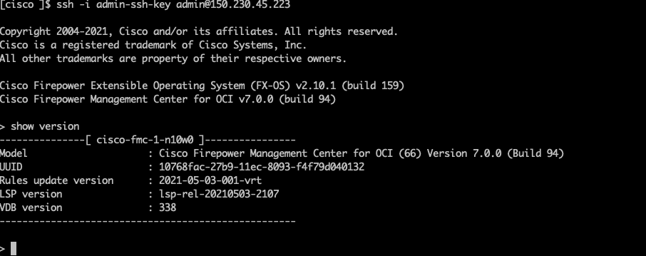

This is a module for [Cisco FMC in OCI](https://www.cisco.com/c/en/us/td/docs/security/firepower/quick_start/fmcv/fpmc-virtual/fpmc-virtual-oci.html). 

## FMC version supported

* 7.x

## Compatibility

This module is meant for use with Terraform version >=1.0.0.


## Prerequisites

You should complete below pre-requisites before proceeding to next section:
- You have an active Oracle Cloud Infrastructure Account.
  - Tenancy OCID, User OCID, Compartment OCID, Private and Public Keys are setup properly.
- Permission to `manage` the following types of resources in your Oracle Cloud Infrastructure tenancy: `vcns`, `internet-gateways`, `route-tables`, `security-lists`, `subnets`, `network-load-balancers` and `instances`.
- Quota to create the following resources: 1 VCN, 1 subnet, and 'n' number of compute instances.

If you don't have the required permissions and quota, contact your tenancy administrator. See [Policy Reference](https://docs.cloud.oracle.com/en-us/iaas/Content/Identity/Reference/policyreference.htm), [Service Limits](https://docs.cloud.oracle.com/en-us/iaas/Content/General/Concepts/servicelimits.htm), [Compartment Quotas](https://docs.cloud.oracle.com/iaas/Content/General/Concepts/resourcequotas.htm).


## Use cases

* [New management network and subnet](examples/single-instance/new-network.tfvars.example)
  When **network_strategy** input variable is "Create New VCN and Subnet", the terraform creates all the relevant network resources.  
* [Existing management network and subnet](examples/single-instance/existing-network.tfvars.example)
  When **network_strategy** input variable is "Use Existing VCN and Subnet", **subnet_id** is set to ocid of the given subnet. 

## Example usage
Examples of how to use these modules can be found in the [examples](examples/) folder.
- [single instance with new network use case](examples/single-instance/new-network.tfvars.example)
- [single instance with existing network use case](examples/single-instance/existing-network.tfvars.example)


## OCI Resource managed

* A New VCN network, internet gateway, subnet and security list would be created Or use the existing VCN network and subnet.
* A single instance or a number of instances would be created depending on use case.

## Customize ssh key pair

```bash
# Generate a ssh key pair with 2048 bits key as 2048 bits is supported
ssh-keygen -t rsa -b 2048 -f admin-ssh-key
```

Then replace the **admin-ssh-key** public key in the terraform variable file.

## Customize admin password

Please change *admin_password* in *.tfvars.

## Customize security list

* To customize it, please change [security list](modules/networking/main.tf).

## Deployment Options

You can deploy this architecture using two approach explained in each section: 
1. Using Terraform CLI
2. Using Oracle Resource Manager
## Deploy Using the Terraform CLI

```bash
cd examples/single-instance
cp new-network.tfvars.example new-network.tfvars
# modify the  new-network.tfvars to make sure all the values fit the use case 
# such as admin_ssh_pub_key
terraform init 
terraform plan -var-file=new-network.tfvars
terraform apply -var-file=new-network.tfvars
terraform destroy -var-file=new-network.tfvars
```

```
# for existing subnet, set the network_strategy and subnet_id accordingly
cp existing-network.tfvars.example existing-network.tfvars
terraform init 
terraform plan -var-file=existing-network.tfvars
terraform apply -var-file=nexisting-network.tfvars
terraform apply -var-file=existing-network.tfvars
```

## Deploy Using Oracle Resource Manager

In this section you will follow each steps given below to create this architecture:
1. You can use the zip file under *resource-manager* to create a stack according to [ Deploy to Oracle Cloud](https://docs.oracle.com/en-us/iaas/Content/ResourceManager/Tasks/managingstacksandjobs.htm#StackManaging).

2. After creating the stack, click **Terraform Actions**, and select **Plan** from the stack on OCI console UI.

3. Wait for the job to be completed, and review the plan.

    > To make any changes, return to the Stack Details page, click **Edit Stack**, and make the required changes. Then, run the **Plan** action again.

4. If no further changes are necessary, return to the Stack Details page, click **Terraform Actions**, and select **Apply**. 

5. At this stage your architecture should have been deployed successfully. You can proceed to next section for configuring your Cisco VM Series Firewall.

6. If you no longer require your infrastructure, return to the Stack Details page and **Terraform Actions**, and select **Destroy**.


### Screenshots of SSH and HTTPS UI

FMC SSH session
```bash
IP_ADDRESS=$(terraform output -json vm_external_ips  | jq -r '.[0][0]')
ssh -i admin-ssh-key admin@$IP_ADDRESS
```



Please go to FMC GUI via https://${IP_ADDRESS} in a browser.


#### A note on SSH RSA SHA-1

[OpenSSH release 8.8 and up](https://www.openssh.com/txt/release-8.8) disables RSA signatures using the SHA-1 hash algorithm by default.
If you run into an error: `Unable to negotiate with 34.83.229.123 port 22: no matching host key type found. Their offer: ssh-rsa`
Check if the SSH client with `ssh -V` and see if it is 8.8 up, then you can re-enable RSA/SHA1 to allow connection and/or user
authentication via the HostkeyAlgorithms and PubkeyAcceptedAlgorithms.
```bash
~/.ssh/config
Host x.y.z.x
   HostkeyAlgorithms +ssh-rsa
   PubkeyAcceptedAlgorithms +ssh-rsa
```
Alternatively ```ssh -oHostKeyAlgorithms=+ssh-rsa -oPubkeyAcceptedAlgorithms=+ssh-rsa  -i admin-ssh-key admin@${IP_ADDRESS}``` works too.

## Source code files naming convention

* locals.tf: local variables
* variables.tf: input variables
* outputs.tf: output variables
* datasource.tf: define data source such as zones, compute images and template.
* network.tf: define VPC networks, security list. 

## Inputs

| Name | Description | Type | Default | Required |
|------|-------------|------|---------|:--------:|
| compartment_id | The ID of the compartment where VCN networks will be created | string | - | yes |
| region | The region of the VPC networks will be created | string | - | yes |
| network_strategy|CREATE_NEW_VCN_SUBNET or USE_EXISTING_VCN_SUBNET | string| CREATE_NEW_VCN_SUBNET | no |
| subnet_id | The existing subnet id if any| string | "" | yes |
| mangement_vcn_display_name | management VCN Name | string | "mgmt"| no |
| mangement_vcn_cidr_block | management VCN Name | string | "10.22.0.0/16" | no |
| mangement_subnet_cidr_block | management VCN Name | string | "10.22.0.0/24" | no |
| num_instances | Number of instances to create | number | 1 | yes |
| label_prefix | a string that will be prepended to all resources | string | - | yes |
| vm_ads_number | az of vm instances | string | - | yes |
| vm_compute_shape | The machine type of the instance | string | - | yes |
| mp_listing_resource_id | product version of fmc in OCI market place | string| - | no |
| day_0_config | The zero day configuration file name, under templates folder|string| - | no |
| admin_password | fmc admin password | string | - | no |
| admin_ssh_pub_key| ssh public key for admin user | string| - | no |
| hostname |  FMC hostname | string | fmc | no |
| appliance_ips | internal IP address of the cisco appliances | list(string) | [] | yes|

## Outputs

| Name | Description |
|------|-------------|
| subnet_id | The subnet id|
| vm_external\_ips | The external IPs of the vm instances|
| vm_private\_ips | The private IPs of the vm instances's nic0|
