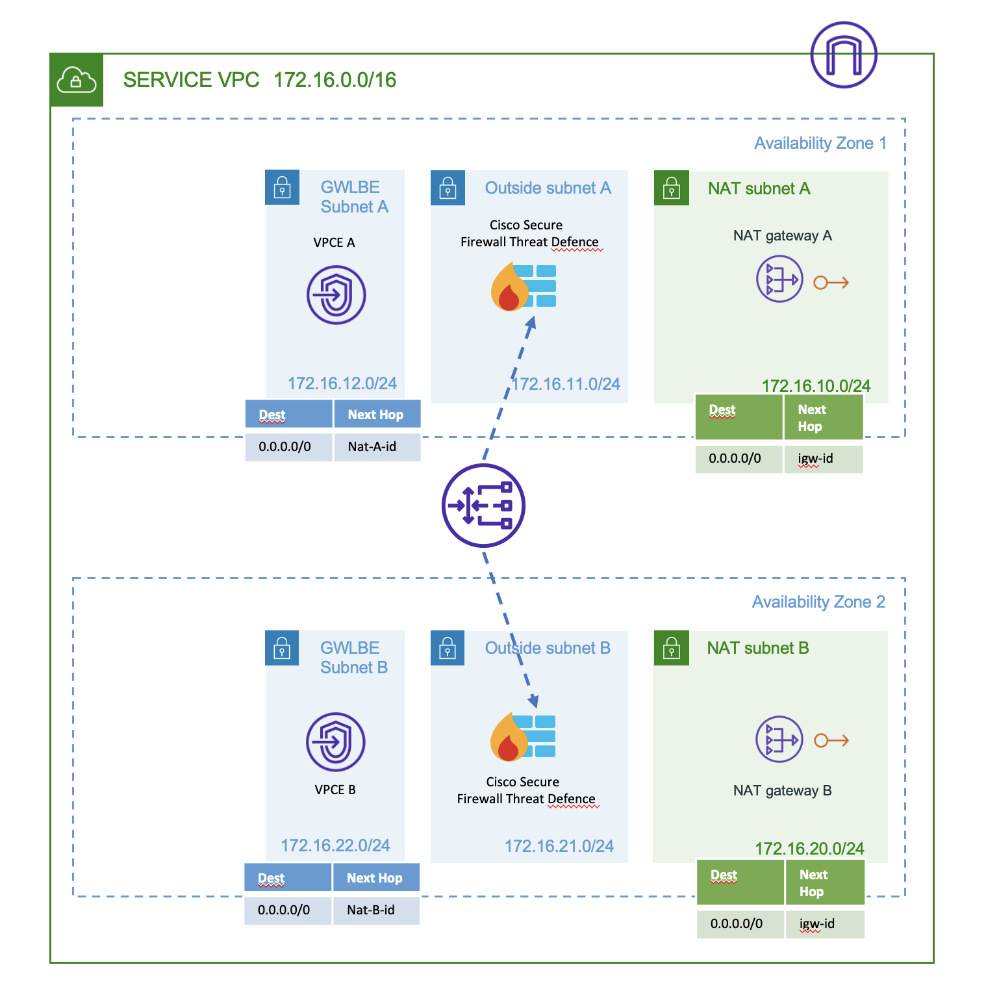

# Cisco Secure Firewall with AWS Gateway Loadbalancer

## Overview

Using this Terraform template, Gateway Load Balancer will be setup in AWS based on the user parameters, with the following components:

- New VPC with IGW or use an Existing VPC
- New Management, Outside, Inside subnets per AZ (Outside subnets will be used as Appliance Subnets) if creating a new VPC
- New GWLBE, NATGW subnets per AZ
- NAT Gateway per AZ
- Gateway load balancer
- Target group for GWLB port 6081
- Endpoint service for GWLB
- GWLB endpoint (one per GWLBE subnet)
- Instance IPs provided by user will be attached to the GWLB target group

## topology

## Prerequisites

Make sure you have the following:

- Terraform – Learn how to download and set up [here](https://learn.hashicorp.com/terraform/getting-started/install.html).
- Programmatic access to AWS account with CLI - learn how to set up [here](https://docs.aws.amazon.com/cli/latest/userguide/cli-chap-configure.html)

The template has been tested on :
- Terraform = v1.0.11

### Parameters

The following variables should be defined with a value in the "terraform.tfvars" file before using the templates. 
*Please note, the value provided below and in .tfvars are just examples. Please change it based on your requirements.*

| Parameter | Meaning | Required |
| --- | --- | --- |
| `aws_access_key` | Access key ID | Y |
| `aws_secret_key` | Secret access key | Y |
| `region` | AWS Region | Y |
| `use_existing_vpc` | Setting to determine if GWLB needs to be created in a new or existing VPC | Y |
| `vpc_name` | Name for new VPC | Y |
| `vpc_cidr` | CIDR block for new VPC | N |
| `igw_name` | Name of the Internet Gateway attached to Existing VPC | N |
| `appliance_subnet` | list of subnets for GWLB | N |
| `GWLB_name` | Name for Gateway load balancer | N |
| `aws_availability_zones` | List of availibility zones in region | N |
| `instance` | List of instances IP address that will be added to the target group | N |

## Deployment Procedure

1) Clone or Download the Repository 
2) Input the values in the terraform ".tfvars" for variables in .tf 
3) Initialize the providers and modules
     - go to the specific terraform folder from the cli 
        $ cd xxxx
        $ terraform init 
4) Submit the terraform plan 
    $ terraform plan -out <filename>
5) Verify the output of the plan in the terminal; if everything is fine, then apply the plan 
    $ terraform apply <out filename generated earlier>

## For Centralized Architecture Deployment

Run the Transit Gateway Terraform plan
<link> 
