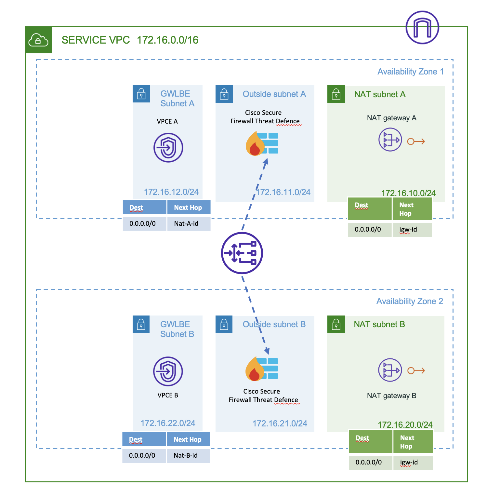

## AWS Gateway Loadbalancer with Cisco Secure Firewall setup

This section contains sample Terraform templates to setup a Gateway Loadbalancer architecture on AWS with Cisco Secure Firewalls as target.

### **GWLB**

[Template to setup Gateway Loadbalaner and associated resources](GWLB)

### **GWLB Centralized Architecture**

[Template to setup a centralized architecture for GWLB deployed using link above](centralized_architecture)

