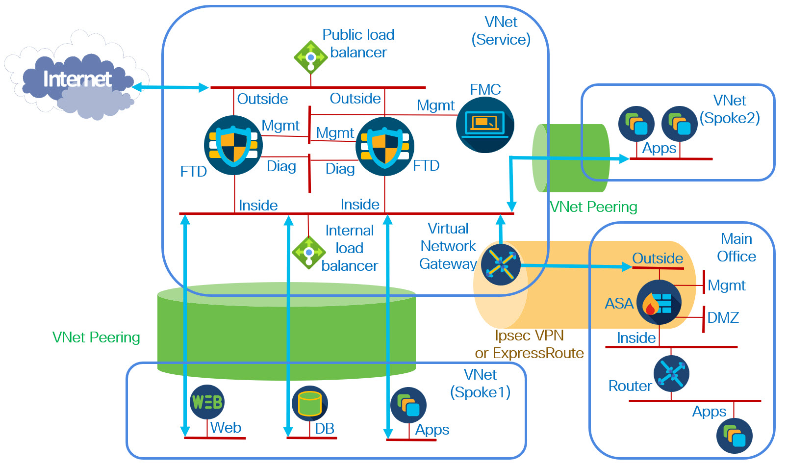

# FTD Auto Scale

## Scope of this Readme and Repository
Deploying the Auto Scale Solution for FTD on Azure requires more than just deploying a template. This Readme does not provide a complete description. It must be used in conjunction with 
<a href="https://www.cisco.com/c/en/us/td/docs/security/firepower/quick_start/azure/ftdv-azure-gsg/ftdv-azure-autoscale.html#Cisco_Generic_Topic.dita_cb9f78b3-3dcf-4a7c-9b9b-abe82ba832df">Auto Scale Solution for FTDv on Azure</a>

The resources in this directory provide enhancements and simplifications in this solution. Please refer to the <b>Workflow</b> section at the end of this readme for details.

## Key Features of this Repository
Here are the changes and enhancements from the version referenced in the <u> Auto Scale Solution for FTDv on Azure></u>guide.  
1. Accelerated Networking is enabled on the data interfaces if the user chooses a version that supports accelerated networking.  
2. IP forwarding is enabled on the data interfaces (this allows east-west traffic inspection without SNAT)  
3. Role assignment (contributor role of function app for VMSS IAM) is automated by the template.  
4. The function variable NETWORK_NAME is now a network group instead of a network object.  
a. This allows for complex nested definitions of the inside IP space.  
b. This network group object must be predefined on the FMC. The function app does not create it.  
c. The function variable NETWORK_CIDR has been removed. 
5. This template creates separate NSGs for the inside and outside interface, as access rules might be different.
6. You can choose tiered (performance based) licensing if you are deploying a version of the software that supports this.
7. You can choose between using public or private addresses for communication between the function app and FMC. You make this decision by choosing either the public or private FMC IP address when configuring the template parameter <b>fmcIpAddress</b>, or equivalently, the function app variable <b>FMC_IP</b>.
8. You can choose between using public or private addresses for FMC to FTD communication. You do this by setting <b>fmcIpAddressType</b>, or equivalently, the function app variable <b>FMC_IP_TYPE</b> to <b>public</b> or <b>private</b>. This also changes the communication between the function app and FTDs. 

## Notes on the Use of Private IP Addresses

To use public addresses in <b>7</b> or <b>8</b> above, you need a mechanism for communication between the function app and the FMC, for example a dedicated, delegated subnet.  The template creates this.  You can switch between public and private addresses after you deploy. This may be useful if you migrate to a new FMC.

To enable use of private IPs, the function app now uses an EP1 (Elastic Premium) plan. I was thinking of making this conditional based on the values of <b>fmcIpAddressType</b>, but there are several benefits to this plan, and the price is nominal. See https://docs.microsoft.com/en-us/azure/azure-functions/functions-premium-plan 

After the function app is installed, you can test communication between the function app and the FMC as follows:

1. Navigate to the function app in the Azure portal.
2. Under the <b>Functions</b> section of the left navigation pane, select <b>Functions</b>. 
3. Click <b>MinimumConfigVerification</b>.
4. Under the <b>Developer</b> section of the left navigation pane, select <b>Code + Test</b>. 
5. Click <b>Test/Run</b>
6. Click <b>Run</b>
7. Confirm that no errors are seen in the console. Errors will appear in red text.

## Availability Zones
If the region supports availability zones, the instances will be distributed among  all availability zones. For example, if a region supports two availability zones and five instances are created, they would be distributed as follows:
* Availability Zone 1 will contain firewall instances 1, 3 and 5.
* Availability Zone 2 will contain firewall instances 2 and 4.

Using all the availability zones in the region is best practice. You can modify this by creating a zones attribute If you want to change this, you can edit the ARM template before deployment, adding a <b>zones</b> attribute to the VMSS. See <a href="https://docs.microsoft.com/en-us/azure/virtual-machine-scale-sets/virtual-machine-scale-sets-use-availability-zones">Create a virtual machine scale set that uses Availability Zones</a> for details. 

## A Note on Software Versions and Instance Types
Software versions and supported instance types frequently change. To avoid the need to edit the template, two parameters were created:
* Software Version Other
* VM Size Other

These parameters can be used to override the drop-down lists for Software Display Version and VM Size. 
To override a parameter, select <b>Other</b> from the drop-down list. You can run the Azure CLI command:

<b>az vm image list --all --publisher cisco --offer cisco-ftdv -o table</b>

to see the current available versions. 
Be sure to check Cisco documentation for supported sizes. Be aware that not all regions support the same sizes.

## Resources Created by the Template
This template creates the following resources. 

* A virtual machine scale set (VMSS)
* A storage account for the VMSS
* A function app
* A function app service plan
* An Application Insights object
* A logic app
* Two load balancers  
&nbsp; - A public load balancer with TCP port 22 probe and two sample load-balancing rules: HTTP and HTTPS  
&nbsp; - An internal load balancer with TCP port 22 probe and one <i>HA Port</i> load-balancing rule to load balance all ports and protocols  
* A public IP address for the public load balancer
* Three security groups, one for each interface of the FTDs (management, inside, and outside) 

Optionally, the template can create a delgation subnet in the VNet where the VMSS is deployed.

## Sample Deployment

In this deployment the service VNet is the hub of a hub-and-spoke datacenter topology. Only one spoke is shown in the figure. Each spoke uses VNet peering to communicate to the service VNet. The two FTDs are instances of a VMSS. In this diagram no delegated subnet is included.

North-south traffic is returned to the proper FTD because of the source NAT configuration. However, an Azure route table must be deployed to handle east-west and outbound traffic. This route table must be associated with every subnet in the spoke. The following is a typical route table:  

Here the inside internal load balancer has frontend IP address <b>10.100.100.81</b> and the route table is associated with three subnets in the spoke. The spoke VNet CIDR is <b>10.101.0.0/16</b>. Note that you need two routes: the default route for north-south and outbound traffic (and inter-spoke traffic, if other spokes exist), and an additional route for intra-spoke east-west traffic within the spoke VNet.  Without the additional route the intra-spoke east-west traffic will bypass the FTD firewall do to effective (implicit) Azure routing.

The routing table above is for a single spoke.  If there are additional spokes or on-premises traffic that needs inspection, additional routes must be added.

## Workflow
The reference
<a href="https://www.cisco.com/c/en/us/td/docs/security/firepower/quick_start/azure/ftdv-azure-gsg/ftdv-azure-autoscale.html#Cisco_Generic_Topic.dita_cb9f78b3-3dcf-4a7c-9b9b-abe82ba832df">Auto Scale Solution for FTDv on Azure</a>
Modifications of this workflow are to use the resources of this repository are as follows.

### Download the Deployment Package
You can skip this section. All required files are available in this repository.

### Build the Azure Function App Package
You can skip this section. The C# code has been pre-compiled and zipped up for you. This file is called <b>ASM_Functions_v3.zip</b>. 

### Prepare the Firepower Management Center
You must add a step. You must create a network group object (not a network object) that contain all the networks you want on the inside of the firewall. This will be referenced as a template parameter <b>internalNetworks</b> or equivalently the function app variable <b>NETWORK_NAME</b>.

### Input Parameters
The template input pararmeters (Table 1). have been added or deleted.
<table>
<tr>
<td>Parameter Name</td>
<td>Allowed Values/Type</td>
<td>Description</td>
</tr><tr>
<td>internalNetworks (added)</td>
<td>string</td>
<td>Name of network group object representing the networks reached by the inside interface of the FTDs. These networks must exist, and a network group object representing these networks must exist on the FMC. This corresponds to the function app variable <b>FMC_IP_TYPE</b>.</td>
</tr><tr>
<td>virtualNetworkCidr (deleted)</td>
<td>string</td>
<td>This parameter is no longer used.</td>
</tr><tr>
<td>softwareVersionOther (added)</td>
<td>string</td>
<td>You can enter a software version not in drop-down list of software versions. This is used to avoid updating the template when supported versions of the software change.</td>
</tr><tr>
<td>vmSizeOther (added)</td>
<td>string</td>
<td>You can enter a VM size not in drop-down list of VM sizes. This is used to avoid updating the template when supported instance types change.</td>
</tr><tr>
<td>fmcIpAddressType (added)</td>
<td>string</td>
<td>Type of address (private or public) used for communication between the FMC and FTDs.</td>
</tr><tr>
<td>createDelegatedSubnet (added)</td>
<td>boolean</td>
<td>If set to true, the template will create a subnet for the function apps to communicate with the private addresses. If saet to false, you must use public addresses or manual configure Azure to allow this communication. This subnet will be created on the virtualNetwork VNet, and delegated to the function app.</td>
</tr><tr>
<td>delegatedSubnet (added)</td>
<td>string</td>
<td>Name of delegated network to be created.</td>
</tr><tr>
<td>delegatedSubnetAddressPrefix (added)</td>
<td>string</td>
<td>CIDR for delegated network.</td>
</tr><tr>
<td>performanceTier (added)</td>
<td>string</td>
<td>Name license tier for FTDs. You can set this to <b>Legacy<b> to avoid using tiered licenses.</td>
</tr>
</table>

### Configure Licensing
If you are using the 7.0 release, you have the option of using tiered licensing (licensing based on throughput). If you wish to do this, you must make sure you have enough of the tiered licenses.

### Download the Deployment Package (this time referring to the ARM template)
You can skip this step.

### Deploy the Auto Scale ARM Template
There are some differences in the ARM template covered below.

### Deploy the Azure Function App
Skip <b>Before you begin</b>.
 Skip Step 5 and Step 6. The file <b>ftdssh.exe</b> is available in this repository.

### Configure the IAM Role in the Virtual Machine Scale Set
Skip this section. This is automatically done by the function app.

### Update the Azure Logic App
Use the same proceedure. But for convenience, the logical app file is included in this repository, and called <b>autov3.logicApp.json</b>.

