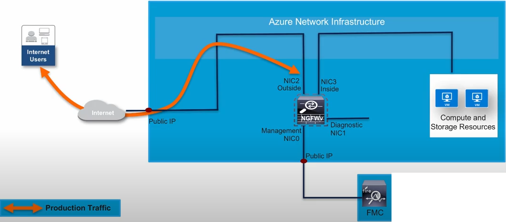

### Terraform Template for Installation of a Single Instance of FTDv on Azure in an Existing Resource Group



## Prerequisites

Make sure you have the following:

- Terraform – Learn how to download and set up [here](https://learn.hashicorp.com/terraform/getting-started/install.html).
- Azure CLI – Learn how to download and set up [here](https://docs.microsoft.com/en-us/cli/azure/install-azure-cli)

Make sure to login to Azure using below command to create any resources using Azure CLI:

```bash
az login --use-device-code
```

If you have multiple Subscriptions available, set default one using Subscription Name or Subscription ID:

```bash
az account set -s "MSDN Azure Subscription"
```

If this your first time of using FTDv instances on this Subscription, you have to read and accept the legal terms of the image first:
```bash
az vm image terms show --offer cisco-ftdv --plan ftdv-azure-byol --publisher cisco --query '{LicenseText:licenseTextLink, MarketplaceTerms:marketplaceTermsLink}'

az vm image terms accept --offer cisco-ftdv --plan ftdv-azure-byol --publisher cisco
```

The template has been tested on :

- Terraform Version =  1.0.1
- Hashicorp AzureRM Provider = 2.53.0

Using this Terraform template, one instance of FTDv will be deployed in Azure in an existing Resource Group based on the user requirements as provided in the tfvars file.

- Resource Group, Virtual Network and Subnets to be used by FTDv instance should exist and their names should be provided in the tfvars file.

- Public IPs will be attached to the Management and Outside interfaces of FTDv instances.


### Variables

The variables should be defined with a value in the "terraform.tfvars" file before using the templates.

| Variable | Meaning |
| --- | --- |
| `location = "centraleurope"` | Resorce group Location in Azure |
| `prefix = "cisco-ftdv"` | This would prefix all the component with this string |
| `source-address = "*"` | Limit the Management access to specific source IPs |
| `Version = "700.94.0"` | FTD Version to be deployed - Please validate the correct version using - `az vm image list --offer ftdv --all` |\
| `VMSize = "Standard_D3_v2"` | Size of the FTDv to be deployed |
| `rg_name` | Name of Resource Group in which FTDv instance will be deployed |
| `vn_name` | Name of Virtual Network to be used in FTDv instances deployment |
| `management_subnet` | Management Subnet Name |
| `diagnostic_subnet` | Management Subnet Name |
| `outside_subnet` | Management Subnet Name |
| `inside_subnet` | Management Subnet Name |
| `instancename = "cisco-ftdv"` | Instance Name and properties of FTDv |
| `username` | Username to login to FTD |
| `password` | Password to login to FTD |

## Deployment Procedure

1) Clone or Download the Repository
2) Input the values in the terraform ".tfvars" for variables in .tf
3) Initialize the providers and modules

    ```ftd
     - go to the specific terraform folder from the cli 
        cd xxxx
        terraform init 
    ```

4) submit the terraform plan

    ```ftd
       terraform plan -out <filename>
    ```

5) verify the output of the plan in the terminal; if everything is fine, then apply the plan

    ```ftd
        terraform apply <out filename generated earlier>
    ```

6) Check the output and confirm it by typing "yes."

## Post Deployment Procedure

1) SSH to the instance by using ssh admin@PublicIP

*Note: The security group attached to the interfaces in this template allow traffic from anywhere. It is necessary to change the security group to allow only the required traffic to and from the specific IP address and ports.*
