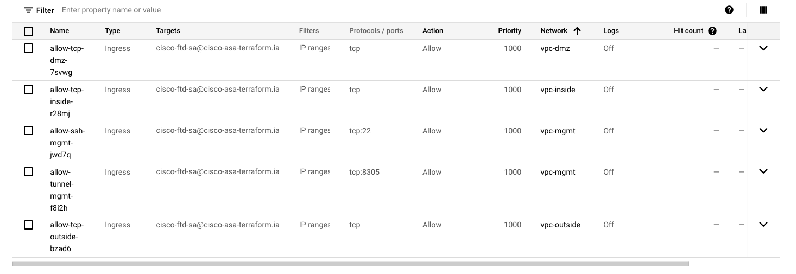

This module simplifies the deployment of [Cisco FTDv in GCP](https://www.cisco.com/c/en/us/td/docs/security/firepower/quick_start/gcp/ftdv-gcp-gsg/ftdv-gcp-deploy.html).

## FTD version supported

* 7.x

## Compatibility

This module is meant for use with Terraform version >=1.0.0.

## Examples

Examples of how to use these modules can be found in the [examples](examples/) folder.

* [single instance use case](examples/single-instance.yaml)
* [multi instance use case](examples/multi-instances.yaml)
Please note, new VPC networks would be created.

## GCP Resource managed

* New VPC networks, subnets and firewall rules would be created.
* A service account is created and is used as target for firewall rules.
* A single instance or a number of instances would be created depending on use case.

## Customize ssh key pair

```bash
# Generate a ssh key pair with 2048 bits key as 2048 bits is supported by ASA
ssh-keygen -t rsa -b 2048 -f admin-ssh-key
```

Then replace the **admin-ssh-key** public key in the configuration yaml.

## Customize firewall rules

.

* Firewall rules would be created as shown.
* Management network allows TCP port 22 and 8305 while other networks allows all TCP ports by default.
* To customize it, please change [networking.py](templates/networking.py).

## Customize service account

`account_id` is the GCP service account, it can be customized for different deployment if desired.

A service account is a special type of Google Account that represents a Google Cloud service identity or app rather than an individual user. Like users and groups, service accounts can be assigned IAM roles to grant access to specific resources. Service accounts authenticate with a key rather than a password. Google manages and rotates the service account keys for code running on Google Cloud. We recommend that you use service accounts for server-to-server interactions.

Please don't use the default compute engine service account which has the project editor role by default, obviously too permissive. The template would create a service account.

## Deploy Using Deployment Manager

```bash
gcloud deployment-manager deployments create ftd \
    --config examples/single-instance.yaml
```

## Screenshots of SSH
FTD SSH session
```bash
ssh -i admin-ssh-key admin@$NIC0_EXTERNAL_IP_ADDRESS
```


### A note on SSH RSA SHA-1

[OpenSSH release 8.8 and up](https://www.openssh.com/txt/release-8.8) disables RSA signatures using the SHA-1 hash algorithm by default.
If you run into an error: `Unable to negotiate with 34.83.229.123 port 22: no matching host key type found. Their offer: ssh-rsa`
Check if the SSH client with `ssh -V` and see if it is 8.8 up, then you can re-enable RSA/SHA1 to allow connection and/or user
authentication via the HostkeyAlgorithms and PubkeyAcceptedAlgorithms.
```bash
~/.ssh/config
Host x.y.z.x
   HostkeyAlgorithms +ssh-rsa
   PubkeyAcceptedAlgorithms +ssh-rsa
```

Alternatively ```ssh -oHostKeyAlgorithms=+ssh-rsa -oPubkeyAcceptedAlgorithms=+ssh-rsa  -i admin-ssh-key admin@${IP_ADDRESS}``` works too.

## Source code files naming convention

* templates/*.py :*Template files*
* templates/*.py.schema :*Schema files*
* templates/ftd.py :*Global template file to be used for the use cases*
* examples/*.yaml :*Configuration files*
* scripts/*.txt :*Script files just for reference as the commands are replicated in the Python code*
* helpers/*.py :*Helper files*

## Inputs

| Name | Description | Type | Default | Required |
|------|-------------|------|---------|:--------:|
| project_id | The ID of the project where VPC networks will be created | string | - | yes |
| region | The region of the VPC networks will be created | string | - | yes |
| networks | A list of VPC network related data such as name, cidr range, appliance ip, has external ip or not  | `list`| [] | no |
| mgmt_network | The name of management VPC network | string | vpc-mgmt | no |
| diag_network | The name of dmz2 VPC network | string | vpc-diag | no|
| outside_network | The name of outside VPC network | string | vpc-mgmt | no|
| inside_network | The name of inside VPC network | string | vpc-inside | no |
| dmz_network | The name of dmz VPC network | string | vpc-dmz | no|
| num_instances | Number of instances to create | number | 1 | no |
| vm_zones | zones of vm instances | string | - | yes |
| vm_machine_type | The machine type of the instance | string | - | yes |
| vm\_instance\_labels | Labels to apply to the vm instances. | `map(string)` | `{}` | no |
| vm\_instance\_tags | Additional tags to apply to the instances.| `list(string)` | `[]` | no |
| cisco_product_version | product version of cisco appliance | string| - | no |
| day_0_config | The zero day configuration file name, under templates folder|string| - | yes |
| admin_ssh_pub_key| ssh public key for admin user | string| - | yes |
| custom_route_tag | custom route tag for the appliance | string | false | no |
| hostname |  FTD hostname | string | cisco-ftd | no |
| admin_password | ftd admin password | string | - | yes |

## Outputs

| Name | Description |
|------|-------------|
| vm\_urls| The self link URLs of the vm instances|
| vm_external\_ips | The external IPs of the vm instances|