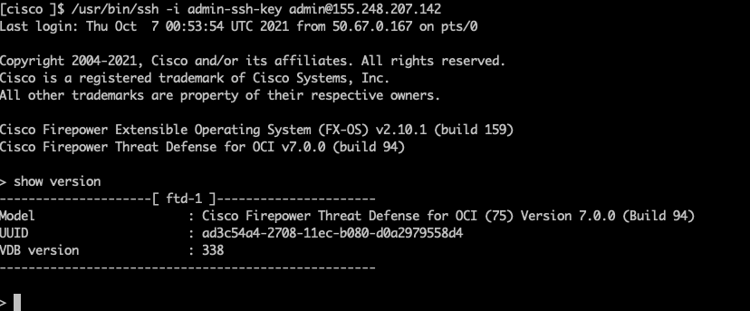

This module simplifies the deployment of [Cisco FTD in OCI](https://www.cisco.com/c/en/us/td/docs/security/firepower/quick_start/oci/ftdv-oci-gsg/ftdv-oci-deploy.html).

## FTD version supported

* 7.x

## Compatibility

This module is meant for use with Terraform version >=1.0.0.

# Prerequisites

You should complete below pre-requisites before proceeding to next section:
- You have an active Oracle Cloud Infrastructure Account.
  - Tenancy OCID, User OCID, Compartment OCID, Private and Public Keys are setup properly.
- Permission to `manage` the following types of resources in your Oracle Cloud Infrastructure tenancy: `vcns`, `internet-gateways`, `route-tables`, `security-lists`, `subnets` and `instances`.
- Quota to create the following resources: 4 VCNs, 4 subnets, and 2 compute instances.

If you don't have the required permissions and quota, contact your tenancy administrator. See [Policy Reference](https://docs.cloud.oracle.com/en-us/iaas/Content/Identity/Reference/policyreference.htm), [Service Limits](https://docs.cloud.oracle.com/en-us/iaas/Content/General/Concepts/servicelimits.htm), [Compartment Quotas](https://docs.cloud.oracle.com/iaas/Content/General/Concepts/resourcequotas.htm).

## Examples

Examples of how to use these modules can be found in the [examples](examples/) folder.
- [single instance use case](examples/single-instance/terraform.tfvars.example)


## OCI Resource managed

* New VCN networks, internet gateway, route table, subnets and security lists would be created.
* A single instance or a number of instances would be created depending on use case.

## Customize ssh key pair

```bash
# Generate a ssh key pair with 2048 bits key as 2048 bits is supported
ssh-keygen -t rsa -b 2048 -f admin-ssh-key
```

Then replace the **admin-ssh-key** public key in the terraform variable file.

## Customize security list

* To customize it, please change [security list](modules/networking/main.tf).

## Deploy Using the Terraform CLI

```bash
cd examples/single-instance
cp oob.tfvars.example terraform.tfvars
terraform init
terraform plan
terraform apply
terraform destroy
```
## Cisco CLI validation

FTD SSH session
```bash
IP_ADDRESS=$(terraform output -json vm_external_ips  | jq -r '.[0]')
ssh -i admin-ssh-key admin@$IP_ADDRESS
```


### A note on SSH RSA SHA-1

[OpenSSH release 8.8 and up](https://www.openssh.com/txt/release-8.8) disables RSA signatures using the SHA-1 hash algorithm by default.
If you run into an error: `Unable to negotiate with 34.83.229.123 port 22: no matching host key type found. Their offer: ssh-rsa`
Check if the SSH client with `ssh -V` and see if it is 8.8 up, then you can re-enable RSA/SHA1 to allow connection and/or user
authentication via the HostkeyAlgorithms and PubkeyAcceptedAlgorithms.
```bash
~/.ssh/config
Host x.y.z.x
   HostkeyAlgorithms +ssh-rsa
   PubkeyAcceptedAlgorithms +ssh-rsa
```

## Inputs

| Name | Description | Type | Default | Required |
|------|-------------|------|---------|:--------:|
| tenancy_ocid | The ID of the user tenant | string | - | yes |
| user_ocid | Oracle Cloud Identifier of user deploying the resources | string | - | yes |
| fingerprint | Fingerprint of the user's API Key | string | - | yes |
| private_key_path | Path of the user's API key on the local system | string | - | yes |
| compartment_id | The ID of the compartment where VCN networks will be created | string | - | yes |
| region | The region of the VCN networks will be created | string | - | yes |
| networks | A list of VCN network related data such as name, cidr range, appliance ip, has external ip or not  | `list`| [] | no |
| mgmt_network | The name of management VCN network | string | VCN-mgmt | no |
| diag_network | The name of dmz2 VCN network | string | VCN-diag | no|
| outside_network | The name of outside VCN network | string | VCN-mgmt | no|
| inside_network | The name of inside VCN network | string | VCN-inside | no |
| dmz_network | The name of dmz VCN network | string | VCN-dmz | no|
| num_instances | Number of instances to create | number | 1 | no |
| label_prefix | a string that will be prepended to all resources | string | - | yes |
| vm_ads_number | az of vm instances | string | - | yes |
| vm_compute_shape | The machine type of the instance | string | - | yes |
| mp_listing_resource_id | product version of ftd in OCI market place | string| - | no |
| day_0_config | The zero day configuration file name, under templates folder|string| - | yes |
| admin_ssh_pub_key| ssh public key for admin user | string| - | yes |
| admin_password | ftd admin password | string | - | yes | 
| hostname |  FTD hostname | string | ftd | no |

## Outputs

| Name | Description |
|------|-------------|
| networks\_list| The internal networks data structure used|
| vm_external\_ips | The external IPs of the vm instances|
| vm_private\_ips | The private IPs of the vm instances's nic0|